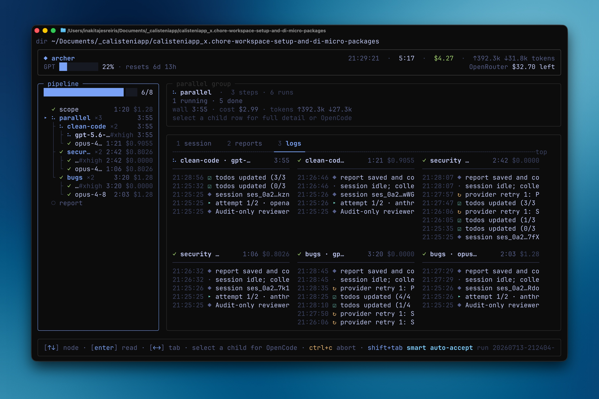

<p align="center">
  
</p>

<p align="center"><em>An orchestration harness for multi-model agent pipelines.</em></p>

<p align="center">
  
</p>

Convoy takes a PRD and turns it into a structured, reviewable implementation: a **pipeline** of specialized agents — implementer, pattern auditor, security auditor, design polisher, test engineer, adversarial reviewer — each step a fresh agent on the model best suited to its job, leaving one commit per phase. It is built on top of [OpenCode](https://opencode.ai), so every step can run on any model from any provider you are authenticated with, within the same run.

**Why it exists:** a single agent in a single session produces a first draft, not shippable code. The quality comes from what happens after that first pass — pattern alignment, security auditing, tests, adversarial review — and that follow-through is exactly the part nobody wants to orchestrate by hand. Convoy makes it repeatable: audits fan out in parallel across different models (a GPT and a Claude reviewing the same diff catch different things), findings are triaged adversarially before any fix lands, and named human gates go wherever you want them.

Typical uses:

- **Ship a feature from a PRD.** `convoy --prompt-file prd.md` runs the default `implement` pipeline; what lands has already been pattern-aligned, security-audited, design-polished, tested, and adversarially reviewed — one commit per phase, so you review a story, not a blob.
- **Harden a branch you already have** — hand-written, or another agent's output. `convoy -p refine "what this branch does"` audits the current diff (scope, bugs, clean code, security), triages the findings adversarially, applies only the accepted fixes, and validates them.
- **Get a second opinion before merging.** `convoy -p review "pre-merge check"` changes no code: each audit runs in parallel on two different models and everything is synthesized into one prioritized findings report at `reports/report.md`.
- **Turn up the rigor for risky changes.** `ultra-implement` and `ultra-refine` fan every review out across two models, then finish with a fixer that applies only blocking findings and a final validator.
- **Encode your team's actual workflow.** Pipelines are YAML in `.convoy/config.yaml`: define, say, a `ship` pipeline — refine the branch, sync it with its base, draft the PR — and run `convoy -p ship`.

Use it as a **CLI** or as a **TUI**, interchangeably: every run can be launched with plain flags and prompt files (`--no-tui` gives you plain logs for pipes and CI), or driven entirely from the TUI — `convoy` with no arguments opens the interactive launcher, every run gets a live dashboard, `convoy runs` browses past runs, and `convoy config` edits global and project config in place.

**Pipelines are data, not code.** Convoy ships a family of built-in pipelines (`implement` — the default — plus `implement-lite`, `ultra-implement`, `refine`, `ultra-refine`, and the report-only `review` and `review-lite`; see [Built-in pipelines](#built-in-pipelines)), and a project can define its own — any number of steps, its own agents, its own models, with named human gates anywhere — in `.convoy/config.yaml`.

Beyond sequencing agents, Convoy owns the operational layer around OpenCode: repo context attachment, runtime guard rails, a live permission gate, commit safety, phase reports, diff tracking, and a TUI that shows cost, tokens, and provider limits while the run is live.

Convoy is written in Bun + TypeScript and uses `@opencode-ai/sdk` to control OpenCode. The SDK starts/controls the OpenCode server; Convoy no longer manually calls `opencode run` nor parses stdout.

## The default pipeline: `implement`

`implement` is the pipeline convoy runs when you don't pass `-p/--pipeline`.

```
PRD ──► implementer ──► patterns ──► security ──► design ──► tests ──► adversarial
         │               │            │            │          │         │
         └───────────────┴────────────┴────────────┴──────────┴─────────┘
                                          commit per phase
```

| Step | Agent | Model | What it does |
|---|---|---|---|
| `implementer` | `implementer` | `openai/gpt-5.6-terra#xhigh` | Implements the feature respecting repo patterns |
| `patterns` | `pattern-auditor` | `openai/gpt-5.6-terra#xhigh` | Refactors without changing behavior, aligns with the rest of the code |
| `security` | `security-auditor` | `openai/gpt-5.6-terra#xhigh` | Audits and fixes security issues |
| `design` | `design-polisher` | `openrouter/z-ai/glm-5.2` | Polishes UI following the repo's design system |
| `tests` | `test-engineer` | `openai/gpt-5.6-terra#xhigh` | Automated tests + relevant E2E/integration coverage |
| `adversarial` | `adversarial-reviewer` | `openrouter/z-ai/glm-5.2` | Final adversarial review before PR creation |

## Built-in pipelines

Convoy ships these pipelines; select one with `-p/--pipeline` (no config needed). A project can add or override any of them in `.convoy/config.yaml`.

| Pipeline | Changes code? | What it does |
|---|---|---|
| `implement` | yes | **The default** (runs with no `-p`). Implement a PRD, then audit, polish, test, and adversarial review (the table above). |
| `implement-lite` | yes | Same workflow and agents as `implement`, but swaps the GPT 5.6 Terra xhigh phases (`implementer`, `patterns`, `security`, `tests`) to `openrouter/z-ai/glm-5.2` for a lower-cost implementation run. |
| `ultra-implement` | yes | Like `implement`, but the pattern/security/adversarial reviews of the initial diff run in parallel across two models feeding a triage step, and the run ends with an audit-only final review, a fixer that applies only blocking findings, and a final validator. |
| `refine` | yes | Audit the current diff (scope → bugs → clean-code → security), triage the findings adversarially, apply the accepted fixes, then validate them. |
| `ultra-refine` | yes | Like `refine`, but every read-only audit is fanned out across two models before triage, fixes, and validation. |
| `review` | **no — report only** | Scope the diff, run the bug / clean-code(+patterns) / security audits **in parallel across two models each**, then a single step synthesizes everything into one prioritized findings report. Makes no changes; the run's output is `reports/report.md`, which you read to decide whether to follow up with a `refine` run. |
| `review-lite` | **no — report only** | Same as `review`, but scope and the first audit model swap from Opus / GPT 5.6 Terra xhigh to `openrouter/z-ai/glm-5.2`; the second parallel audit model and the final report stay on Opus 4.8. |

`refine`/`ultra-refine` are the change-applying counterparts of `review`: run `review` first to get a report, then `refine` if you want the fixes applied.

## Requirements

- Bun 1.0+
- `opencode` installed and authenticated (`opencode auth login`)
- `git`

## Authentication And Providers

Convoy does not store provider credentials. It starts `opencode serve` through the SDK and passes only runtime agent configuration via `OPENCODE_CONFIG_CONTENT`; the server inherits your shell environment and uses the credentials already configured in OpenCode.

Useful commands:

```bash
opencode providers list
opencode providers login --provider openai
opencode providers login --provider anthropic
opencode models openai
opencode models anthropic
```

To use different providers, authenticate them in OpenCode and select models as `provider/model`. Convoy's default `implement` pipeline uses `openai/gpt-5.6-terra#xhigh` for implementation, pattern, security, and test phases, and `openrouter/z-ai/glm-5.2` for design and adversarial review. Use `--pipeline implement-lite` for the lower-cost variant that swaps the GPT phases to `openrouter/z-ai/glm-5.2`.

## Installation

```bash
git clone <this-repo> convoy
cd convoy
bun install
make install
```

This leaves `convoy` in `~/.local/bin/convoy` and creates `~/.convoy/config.yaml` plus `~/.convoy/agents/*.md` with Convoy's default configuration if they do not already exist. Make sure `~/.local/bin` is in your `PATH`.

## Usage

From the root of the target repo, ideally on a working branch:

```bash
# interactive launcher: choose a pipeline, enter the prompt, then toggle options
convoy

# inline prompt
convoy "Add onboarding screen with 3 steps and local persistence of progress"

# prompt from file
convoy --prompt-file prd.md

# attach files or directories to all phases
convoy --prompt-file prd.md --file src/features/onboarding --file tests/onboarding.test.ts

# run a project-defined pipeline (see "Project configuration" below)
convoy --prompt-file bug.md --pipeline bug-fix

# only one step
convoy --prompt-file prd.md --only implementer

# skip steps
convoy --prompt-file prd.md --skip security,design

# force a different model for all steps
convoy --prompt-file prd.md --model anthropic/claude-sonnet-4-6

# disable the OpenTUI progress footer
convoy --prompt-file prd.md --no-tui

# drop human gates (for pipelines that define them)
convoy --prompt-file prd.md --no-human-step

# resume a failed run (phases that already wrote their report are skipped,
# and the dashboard restores their real duration, cost, and session).
# If a phase was interrupted before its commit and left the working tree dirty,
# an interactive resume asks whether to commit those changes as that phase and
# continue with the following ones.
convoy --resume 20260519-103045-x7q2

# browse run history in the dashboard TUI: a selectable list (newest first,
# with status, date, cost, and prompt) plus a details panel with the per-phase
# breakdown. A run still executing shows a green ● "running" and can be
# attached. ↑/↓ select, [enter] re-open its dashboard (attach if it's live,
# else reconstruct it for inspection), [r]esume (re-runs the failed/unfinished
# phases), [s]ummary/reports overlay, subshell in the run [d]ir under
# ~/.convoy/runs (exit to return), [q]uit.
# Pass a run ID to open the browser with that run preselected.
# Without a TTY (pipes/CI) it falls back to a plain listing.
convoy runs
convoy runs 20260519-103045-x7q2

# view and edit the global (~/.convoy) and current project config in a TUI:
# two tabs (Global / Project), pick models with autocomplete, edit pipelines
# and steps, or initialize a starter config when none exists.
convoy config

# create project-local config and prompt files you can customize
convoy init

# create global defaults (~/.convoy) instead of project-local
convoy init --global

# overwrite an existing config file
convoy init --force

# auto-allow ask-level permissions (the hard denylist still applies)
convoy --prompt-file prd.md --yolo

# smart auto-accept: an AI judge allows safe requests and escalates risky ones
convoy --prompt-file prd.md --smart --smart-model anthropic/claude-haiku-4-5

# delete the run dir after successful completion (kept by default)
convoy --prompt-file prd.md --no-keep-run-dir

# change the base branch used to calculate diffs between phases
# (when omitted, convoy auto-detects it: origin's default branch, else
# main/master/develop/trunk, else the current branch)
convoy --prompt-file prd.md --base develop

# include existing local changes in the first commit of the pipeline
convoy --prompt-file prd.md --include-dirty --max-attempts 1
```

In interactive terminals, Convoy shows a full-screen OpenTUI dashboard headed by a compact run summary (clock, elapsed, cost, tokens). The `pipeline` panel on the left is a tab selector: every step — done, running, or still scheduled — is a row you move through with `↑`/`↓` (or `j`/`k`), or by clicking, with `▸` marking the focused one. Focusing a step drives the whole right side to it: a detail panel (name; whether it's ongoing, done, failed, or scheduled; model; cost; tokens; attempt; files changed) over that step's todo list and a three-tab content panel — switched with `←`/`→`, `Tab`, the number keys `1`/`2`/`3`, or by clicking the tab strip. The tabs are `logs` (the step's color-coded activity feed), `reports` (the markdown report that step wrote, if any, scrollable with `PgUp`/`PgDn` — available live the moment a step finishes, not only at the end), and `session` (a read-only "follow along" view of that step's OpenCode session: its live state — reasoning, running a command, editing, applying a diff — model, attempt, cost, diff summary, and a scrolling transcript of what the model is doing, newest at the bottom). A not-yet-started step reads as `scheduled` with its planned model and zeroed usage, so you can inspect what's coming; focus auto-follows the active step until you navigate, and `Esc` hands it back to auto-follow. The dashboard never paints backgrounds: the canvas is your terminal's own background and panels are delineated by borders alone, derived as subtle elevations of the terminal's reported background color, with dark or light accents picked by its brightness (and a neutral fallback when the terminal doesn't answer); floating modals repaint the reported color exactly to mask the content beneath them. It follows live theme changes. For full interactivity, press `o` (or click the detail panel) to open the focused step's OpenCode session in a new terminal window attached to Convoy's running OpenCode server; clicking a pipeline row only focuses that step — it no longer opens the session. Ghostty is preferred when installed; Terminal.app is the fallback (`CONVOY_TERMINAL=ghostty|terminal` forces a backend). Press `Shift+Tab` to cycle auto-accept modes — off, auto-accept, smart (see the permission gate below). Press `Ctrl+C` once to abort the active OpenCode session and shut down Convoy cleanly; press it again to force exit if cleanup hangs. Human gates stay inside the dashboard (`c` continue · `o` open OpenCode · `a` abort); without a TTY dashboard they fall back to plain terminal prompts. Use `--no-tui` to fall back to plain logs.

Press `i` on a running step to arm **interactive takeover**: the step's session opens in a new terminal window (like `o`) and, from that moment, the orchestrator stops acting on that step by itself — no retries, no baseline restore, no auto-completion. Stop the agent from the OpenCode window (`esc`) and work in the session manually; whenever the attempt ends (your interruption, an error, or even a clean finish), the dashboard shows an `interactive session` gate and waits: `c` commits whatever the working tree holds as the step's commit and continues the pipeline, `o` reopens the session window, `a` aborts the run leaving the tree untouched. Press `i` again before the attempt ends to disarm and hand the step back to the normal retry logic.

When the run ends (success or failure), the dashboard doesn't close — it stays on the very same layout, now frozen for browsing. The pipeline is still the tab selector: move with `↑`/`↓` (or `j`/`k`, or click a phase) to inspect any phase's outcome, duration, model, cost, and diff, and switch its `logs`/`reports`/`session` tabs exactly as during the run (`PgUp`/`PgDn` scroll long reports). Press `o` to open the selected phase's OpenCode session in a new terminal window (the server stays alive while the screen is up), and `g` to open lazygit in the target repo as a subshell — `git log --graph --decorate --stat` is the fallback when lazygit isn't installed. Press `q`, `Esc`, or `Ctrl+C` to close; only then does Convoy clean up the run dir and stop its OpenCode server. Failed runs pre-select the failed phase and show its error.

This same dashboard is reachable after the fact from `convoy runs`: pressing `enter` on a run re-opens it without resuming. If the run is still executing (its OpenCode server is up — the browser marks it with a green ● "running"), Convoy **attaches** to it: history is replayed from the run's metadata and the active phase's OpenCode events are mirrored into the dashboard in real time, read-only — `Ctrl+C` detaches without touching the run. If the run has stopped (completed, failed, or interrupted), Convoy **reconstructs** it from metadata + on-disk reports and shows the browsable finish screen, where `[o]` opens a phase's stored session standalone (`opencode <dir> --session <id>`, its own server, read from disk). Either way, closing the dashboard returns you to the run browser. This works because a run records its server URL and pid in `metadata.json` while it executes and clears them on clean shutdown, so a lingering entry that no longer answers marks a run that died mid-flight.

Phases run asynchronously: Convoy fires the prompt with OpenCode's async API and detects completion through the event stream (`session.idle` / `session.error`), with a 30-second session-status poll as fallback and automatic event-stream reconnection. No HTTP request stays open for the duration of a phase, so long-running phases are immune to client-side socket timeouts. Convoy also disables OpenCode's total provider request timeout for its default providers and keeps a 10-minute provider stream idle timeout instead.

## Permission gate

Agents run with a restricted bash policy: a small allowlist of safe Flutter/Dart, web/Node, test/build, and read-only git commands; a denylist of unambiguously dangerous patterns (`git push*`, `gh*`, deployment/publish commands, `sudo*`, recursive deletes against `/` or `~`, `curl … | sh`, package installers); and everything else falls through to `ask`.

When an agent runs a command that isn't on the allowlist, Convoy prints the request and prompts:

```
approve? [o]nce, [a]lways, [r]eject >
```

- `o` allows the single call.
- `a` allows future calls matching the same pattern for the rest of the run.
- `r` rejects the call (the agent receives a denial and decides what to do next).

In non-interactive runs (no TTY), unknown commands are auto-rejected and logged. Per-project, extend the lists with `permissions.allow`/`permissions.deny` in `.convoy/config.yaml`; the global policy lives in `src/agents.ts` (`bashPolicy`).

Convoy also allowlists the target repo's own `package.json` scripts whose names look like checks (`test`, `lint`, `typecheck`, `type-check`, `check`, `build`, `format`, `validate`, including suffixed forms like `test:unit`), excluding anything whose name suggests side effects (`deploy`, `publish`, `release`, `migrate`, `seed`, `reset`). Note the trust model: agents can edit the repo, including script bodies, so allowlisted scripts mean trusting the repo's contents — the denylist protects against accidents, it is not a security boundary against a malicious agent.

### Auto-accept (`--yolo` / `--smart` / `Shift+Tab`)

The permission gate has three states. In the dashboard, `Shift+Tab` cycles through them (`off → auto-accept → smart → off`) and the footer always shows the current one:

- **off** — every request that would normally *ask* prompts you.
- **auto-accept** (`--yolo`) — every ask-level request is allowed automatically (replied as "once") and logged to the activity feed. Switching into this state also resolves any prompts already queued.
- **smart** (`--smart`) — each request is handed to an external AI judge running *outside* the agentic loop (a single stateless prompt with every tool disabled, so it can only classify, never act). Requests it judges safe — read-only, local, reversible, no secrets, no exfiltration — are auto-allowed with the reason logged; anything it flags as risky (or any judge error/timeout) falls back to prompting you, with the flag shown in the modal. It is deliberately fail-closed: uncertainty never auto-approves.

The judge model is `--smart-model <provider/model[#variant]>`, falling back to `defaults.autoAcceptJudgeModel` in config, then the run's model. The hard denylist is enforced by OpenCode itself and is never relaxed: denied commands are rejected before they ever reach the gate, in every state.

## Commit safety

Before each commit Convoy scans the staged files for common secret names (`.env*`, `*.pem`, `*.key`, `id_rsa*`, `credentials*`, `*.p12`, `*.keystore`, ...). If any match, the commit is aborted, the index reset, and Convoy asks you to add them to `.gitignore` (or delete them) before re-running. Combined with `--include-dirty` this is the only line of defense against accidentally publishing a secret your working tree had lying around — review the resulting commits with `git show` before pushing.

During a human step, Convoy waits indefinitely for an explicit action: `c` continues the pipeline (committing any manual changes), `o` opens an OpenCode window attached to the run's server (resuming its latest session, so the iteration keeps the run's context), and `a` aborts the run.

## Project configuration (`.convoy/config.yaml`)

A project can reshape convoy entirely from one file. Everything is optional — the file only declares what differs from the defaults. The same schema also lives globally at `~/.convoy/config.yaml` (see [Global configuration](#global-configuration)); the project file is merged on top of it.

```yaml
version: 1

defaults:
  model: openai/gpt-5.6-terra#xhigh     # provider/model[#variant], used by steps with no model of their own
  maxAttempts: 2
  baseRef: main                    # optional; auto-detected when unset (origin default branch, else main/master/develop/trunk, else current branch)
  pipeline: quick                  # pipeline used when -p/--pipeline is not given
  autoAcceptJudgeModel: anthropic/claude-haiku-4-5   # model for smart auto-accept (--smart); defaults to the run's model
  branchNameModel: anthropic/claude-haiku-4-5        # model that names worktree branches (may look up referenced issues)

# Project agents: the prompt lives at .convoy/agents/<name>.md (required).
# Naming a built-in agent here overrides its model/temperature/readOnly instead.
agents:
  api-reviewer:
    description: Reviews public API consistency
    model: anthropic/claude-opus-4-8
    temperature: 0.1
    readOnly: true               # disables write/edit/bash tools for this agent

pipelines:
  quick:
    description: Implementation, manual gate, tests
    steps:
      - implementer                # string = agent (or alias) with that step name
      - type: human                # named human gate, placeable anywhere, repeatable
        name: planning
        description: Plan implementation interactively
      - agent: tests
        maxAttempts: 3
  api:
    steps:
      - implementer
      - api-reviewer               # project agent defined above
      - type: human
        name: api-review
      - agent: security
        reports: all               # attach every previous step report (default: the nearest one)
      - agent: adversarial
        name: final-check          # step name (report file, commit prefix, --only/--skip)
        reports: [implementer, security]
  audit:
    steps:
      - implementer
      - parallel:                  # runs its steps concurrently; every one is forced read-only
          - patterns
          - security
          - agent: clean-code
            models:                # fans this one step out across models, one read-only run per model
              - anthropic/claude-opus-4-8
              - openai/gpt-5.6-terra#xhigh
      - agent: adversarial
        name: triage
        reports: all               # every parallel/fan-out report from above, in one attachment set

hooks:                              # optional shell hooks; top-level = every pipeline
  pre:
    - pnpm lint
  post:
    - command: ./scripts/notify.sh
      when: always                  # success | failure | always; post default is success
      continueOnError: true         # don't fail the run if this hook fails
  pipelines:                        # appended only for the named pipeline
    quick:
      post:
        - name: open-pr
          command: gh pr create --fill
          cwd: target               # target (default) | run
          timeoutSeconds: 120

permissions:                       # additive only; a config allow can never undo a deny
  allow:
    - "supabase gen types*"
  deny:
    - "stripe *"

attachments:                       # attached to every step, like repeatable --file flags
  - docs/architecture.md
```

The rules:

- **Precedence**: CLI flag > project config > global config > built-in default. Within a config, for OpenCode models specifically: step `model` > agent `model` > `defaults.model` > the agent's built-in preference (Opus for design/adversarial when the step doesn't set its own model) > `openai/gpt-5.6-terra#xhigh`. `--model` overrides OpenCode steps only; Claude Code steps keep their own CLI model and Convoy names those unaffected steps at launch.
- **Conventions over wiring**: every agent step gets the PRD, the cumulative diff against the base branch (except the first step; opt out with `diff: false`), and the previous step's report (`reports: previous|all|none|[names]`). Its report lands at `reports/<step>.md`; writable steps commit repository changes as `convoy(<step>): …`, while read-only steps verify that the repository stayed unchanged.
- **Aliases**: the built-in agents answer to their short names in steps — `patterns`, `security`, `design`, `tests`, `adversarial` — as well as their full names.
- **Read-only agents**: set `agents.<name>.readOnly: true` to enforce audit-only behavior. Convoy disables the agent's write/edit/bash tools, denies edit/bash/task permissions, saves the phase report from the assistant response if the agent cannot write it directly, and checks the clean Git baseline before finalizing. If Git-visible files, HEAD, or the active branch change during the step, Convoy fails without committing or deleting anything; the changes stay intact for the user to inspect and resolve.
- **Human steps**: use `type: human` with optional `name` and `description` to insert an interactive gate. The old `human-review` string still works as a legacy shorthand, but named `type: human` steps are preferred for planning, QA, approval, or any other human checkpoint.
- **Claude Code steps**: set `runner: claude-code` on an audit step to execute it with the locally installed [`claude` CLI](https://code.claude.com) instead of an OpenCode session, authenticated by whatever that install already uses — a Claude subscription login or an API key. This is how subscription users get genuine cross-vendor diversity in review pipelines without paying per token. The optional `model` accepts `opus`, `sonnet`, `haiku`, a `claude-*` ID, or the equivalent `anthropic/claude-*` form; omit it to use the CLI default. Convoy launches Claude with `--safe-mode`, disabling repository/user customizations such as `CLAUDE.md`, skills, plugins, hooks, and MCP servers, and exposes only the built-in read/search tools within the target and attached directories. Git-visible file, commit, or branch changes still fail the step but are left intact rather than deleted. Claude Code steps can't fan out across `models:` and stream their thinking/output/tool calls into the dashboard like any other step; their private raw event stream is written incrementally to `logs/<step>.<attempt>.claude.jsonl`, including failed attempts. Once a step finishes, `[o]` reopens its session interactively via `claude --resume --safe-mode` with the same tool envelope and full context. Claude Code is an **optional dependency**: only a pipeline that actually contains such a step requires the CLI, checked fail-fast at launch.
- **Parallel steps and model fan-out**: wrap steps in `parallel: [...]` to run them concurrently, and/or give one step a `models: [...]` list (instead of `model:`) to run it once per model. Both are always forced read-only, regardless of the underlying agent's own `readOnly` setting. Convoy restricts built-in write tools and verifies the Git baseline before finalizing, so any Git-visible mutation fails the step and remains untouched for manual resolution — there's no per-step way to opt out. A `models:` step's variants get disambiguated names (`<step>__<model-slug>`) and reports; `reports: previous` after a parallel block attaches every member's report, and `reports: [<step-name>]` on a fanned-out step's un-suffixed name attaches every one of its model variants. `parallel:` can't nest and can't contain human steps.
- **Project pipelines shadow built-ins**: defining `pipelines.implement` replaces the built-in default pipeline.
- **`--no-human-step` / `--no-human-review`** (and non-TTY runs) drop every human gate from the pipeline.
- **Resume is frozen**: the resolved pipeline is persisted in the run's `metadata.json`; `--resume` replays it even if the config changed since.
- **Dirty-tree recovery**: a writable phase interrupted before its commit (Ctrl+C, a failed commit step, a killed process) leaves uncommitted work in the tree, which normally blocks `--resume`. In an interactive terminal, resume offers to commit that work as the interrupted phase (`convoy(<phase>): …`), mark it done, and continue with the following phases. Read-only phases are never recoverable as agent output: preserved changes must be resolved manually, and resume also verifies their recorded HEAD/branch baseline. Decline (or a non-TTY resume) keeps the old "commit/stash first" behavior.
- **Permissions are additive**: `permissions.deny` extends the hard denylist, `permissions.allow` extends the allowlist, deny always wins, and there is deliberately no way for a repo to grant itself `--yolo`.
- **Hooks are trusted local shell commands**: `hooks.pre` runs after the run workspace/dashboard is initialized and before the pipeline starts (pre-hooks are skipped on `--resume`); `hooks.post` runs at the end according to `when`. Top-level hooks apply to every pipeline, and `hooks.pipelines.<name>` entries are appended for that pipeline. Hooks run via `$SHELL -lc` from the target repo by default, receive `CONVOY_RUN_ID`, `CONVOY_RUN_DIR`, `CONVOY_TARGET_DIR`, `CONVOY_PIPELINE`, `CONVOY_PROMPT_FILE`, and post-hooks also receive `CONVOY_RUN_STATUS`. A failing hook fails the run unless `continueOnError: true` is set. Each hook is also a row in the dashboard pipeline — pre-hooks ahead of the steps, post-hooks after — with live running/✓/✗/skipped status, and the tail of its output lands in that row's `logs` tab; the rows are recorded in the run metadata, so re-opened runs show them too.

## Global configuration

`~/.convoy/config.yaml` uses the exact same schema as the project file and sets your personal defaults across every repo — most usefully `defaults.model`, but also custom agents and pipelines. Global custom agents bring their prompt at `~/.convoy/agents/<name>.md` (the same convention a project uses, relative to your home).

Both files are merged before a run, with the project winning: `defaults`, `agents`, and `pipelines` merge by key/name (a project entry overrides the global one of the same name), while `permissions`, `hooks`, and `attachments` concatenate (global first; `deny` still wins). The home directory convoy reads can be relocated with `CONVOY_HOME` (it points at the directory that holds `.convoy`, and also moves `~/.convoy/runs`).

## Editing config interactively (`convoy config`)

`convoy config` opens a TUI to view and edit both configs without hand-editing YAML — two tabs, **Global** (`~/.convoy/config.yaml`) and **Project** (the current repo's `.convoy/config.yaml`):

- Pick OpenCode models from an autocompleting list: it queries enabled providers (including reasoning variants like `#xhigh`), falls back to [models.dev](https://models.dev), and accepts free-typed `provider/model[#variant]`. Claude Code steps use a runner-aware text editor for CLI aliases/IDs instead.
- Edit `defaults` and each agent's model, temperature, and tri-state `readOnly` override.
- Materialize built-in pipelines as editable overrides; add/delete pipelines; edit sequential and parallel steps, model fan-out, names, reports, diff behavior, attempts, and the step runner. Switching runner clears an incompatible model with confirmation, and Claude Code steps expose their read-only/no-fan-out constraints directly in the detail panel.
- When a tab has no file yet, `initialize` writes a starter config (the built-in `implement` pipeline, expanded and ready to edit).

Keys: `↑/↓` move, `enter` edit/expand, `tab` switch tab, `a` add, `d` delete, `shift+↑/↓` reorder, `t` agent temperature, `m` step attempts, `M` model fan-out, `g` group/ungroup, `n` step name, `r` reports or agent read-only, `R` step runner, `x` diff, `s` save, `q` quit. Saving re-validates and rewrites clean YAML (comments are not preserved); the dashboard never paints backgrounds, like the run TUIs. Needs an interactive terminal.

## Initializing config files (`convoy init`)

`convoy config` is interactive; `convoy init` is its non-interactive counterpart: it writes a commented starter config and copies the built-in agent prompts so you can customize them in place.

```bash
convoy init                # .convoy/config.yaml + .convoy/agents/*.md in the current repo
convoy init --dir ../app   # same, in another repo
convoy init --global       # ~/.convoy/config.yaml + ~/.convoy/agents/*.md
convoy init --force        # overwrite existing files
```

The generated config documents every key (commented out) and inlines the built-in `implement` pipeline so it's immediately editable. The copied `agents/*.md` prompts are picked up by name — edit them to override a built-in agent's prompt, or declare a new agent in the config and add its prompt file. Existing files are never overwritten unless `--force` is given. `make install` runs `convoy init --global` automatically, so a fresh install ships with a ready-to-edit global config.

## Project Context And Custom Agents

Convoy automatically attaches these target-repo files to every phase when they exist:

```text
.convoy/rules.md
AGENTS.md
CLAUDE.md
```

Use `.convoy/rules.md` for project-specific Convoy instructions. It is intentionally the only Convoy rules filename to avoid ambiguous precedence. `AGENTS.md` and `CLAUDE.md` are treated as additional repo context.

Built-in agent prompts live as Markdown files under `prompts/`. A project can fully replace a built-in agent prompt with:

```text
.convoy/
├── config.yaml          # defaults, agents, pipelines, hooks, permissions, attachments
└── agents/
    ├── implementer.md   # overrides the built-in implementer prompt
    ├── pattern-auditor.md
    └── api-reviewer.md  # prompt for a project agent declared in config.yaml
```

When a project override exists, it replaces that agent's built-in prompt completely. Project agents declared in `config.yaml` must bring their prompt at `.convoy/agents/<name>.md` (validated at startup). The same convention applies globally: `~/.convoy/agents/<name>.md` overrides a built-in for every repo. Prompt precedence is `.convoy/agents/<name>.md` (project) > `~/.convoy/agents/<name>.md` (global) > the built-in prompt. In all cases Convoy still appends its non-replaceable runtime safety guard rails from `prompts/runtime-safety.md`.

## Efficient Attachments

`--file` is repeatable and accepts files or directories. Relative paths are resolved against the target repo.

Convoy doesn't paste those contents into the prompt. It sends them to the SDK as `FilePartInput` with `file://` URL, just like OpenCode's `--file`. It does the same internally with `prd.md`, previous reports, and phase diffs.

## Anatomy of a Run

Each invocation creates `~/.convoy/runs/<run-id>/`:

```
~/.convoy/runs/20260519-103045-x7q2/
├── prd.md
├── metadata.json
├── reports/
│   ├── implementer.md
│   ├── patterns.md
│   ├── security.md
│   ├── design.md
│   ├── tests.md
│   └── adversarial.md
├── diffs/
│   ├── patterns.pre.diff
│   ├── security.pre.diff
│   ├── design.pre.diff
│   ├── tests.pre.diff
│   └── adversarial.pre.diff
├── logs/
│   ├── implementer.1.json
│   └── ...
└── SUMMARY.md
```

`metadata.json` records the resolved pipeline the run executes plus each step's status, session ID, timing, cost, tokens, and model as the run progresses (written atomically, debounced). On `--resume`, the frozen pipeline is replayed — even if `.convoy/config.yaml` changed since — and steps that already wrote their report are restored in the dashboard with their real duration, cost, and session, which can still be opened by clicking the pipeline row.

The run dir is kept after the run by default (browse it with `convoy runs`); pass `--no-keep-run-dir` to delete it on successful completion. If the run fails, it's always preserved for inspecting reports, diffs, and logs.

The target repo only sees commits with prefix `convoy(<phase>): ...`, made on the current branch. Normal runs leave no CLI files in the project; `convoy init` intentionally creates `.convoy/config.yaml` when you want project-local configuration.

## Development

```bash
bun install
bun run typecheck
bun test
bun run build
```

## Structure

```
convoy/
├── src/
│   ├── main.ts          # entrypoint
│   ├── cli.ts           # flag parsing
│   ├── runner.ts        # pipeline orchestration
│   ├── opencode.ts      # startup/control via SDK
│   ├── agents.ts        # prompt loading, agent config, bash policy
│   ├── project-context.ts # automatic .convoy/rules.md, AGENTS.md, CLAUDE.md discovery
│   ├── permissions.ts   # live permission gate for tool calls that fall outside the allowlist
│   ├── safety-judge.ts  # external AI judge for smart auto-accept (tool-less, fail-closed)
│   ├── attachments.ts   # FilePartInput for --file and internal attachments
│   ├── git.ts           # diff, commit, and pre-commit secret scan
│   ├── workspace.ts     # run dir, ~/.convoy home (CONVOY_HOME), global config/agents paths
│   ├── runs.ts          # interactive run-history browser (convoy runs)
│   ├── runs-tui.ts      # OpenTUI run-history browser rendering
│   ├── metadata.ts      # per-run metadata.json: frozen pipeline + --resume restore
│   ├── config.ts        # config loader/validation, global+project merge, YAML writer
│   ├── config-tui.ts    # interactive config editor (convoy config)
│   ├── model-catalog.ts # available-model list via OpenCode SDK, models.dev fallback
│   └── pipeline.ts      # built-in agents/pipeline and pipeline-spec resolution
├── prompts/             # built-in agent prompts and runtime safety guard rails
├── test/                # unit tests for CLI/orchestration
├── package.json
├── tsconfig.json
└── Makefile
```
