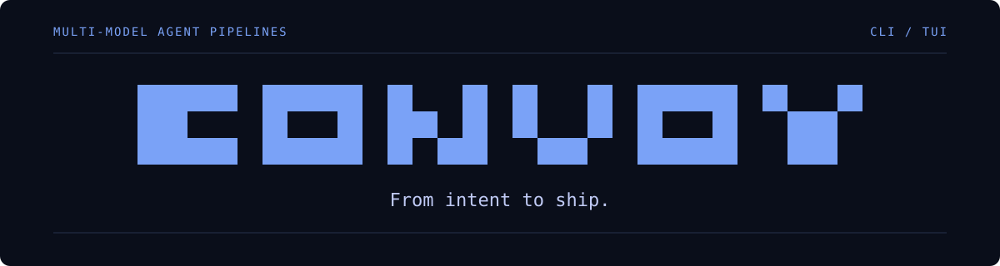
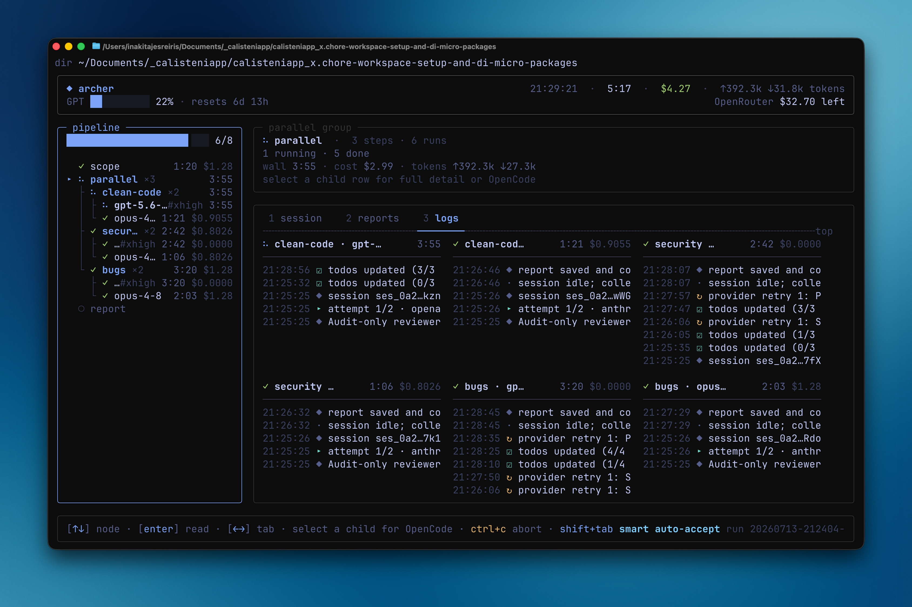

<p align="center">
  
</p>

<p align="center"><em>An orchestration harness for multi-model agent pipelines.</em></p>

<p align="center">
  <a href="https://github.com/Inakitajes/convoy/actions/workflows/ci.yml"></a>
  <a href="./assets/coverage.svg"></a>
  
  
</p>

<p align="center">
  
</p>

Convoy takes a PRD and turns it into a structured, reviewable implementation: a **pipeline** of specialized agents — implementer, pattern auditor, security auditor, design polisher, test engineer, adversarial reviewer — each step a fresh agent on the model best suited to its job, leaving one commit per phase and closing with a one-page recap of what every phase found. It is built on top of [OpenCode](https://opencode.ai), so every step can run on any model from any provider you are authenticated with, within the same run.

**Why it exists:** a single agent in a single session produces a first draft, not shippable code. The quality comes from what happens after that first pass — pattern alignment, security auditing, tests, adversarial review — and that follow-through is exactly the part nobody wants to orchestrate by hand. Convoy makes it repeatable: audits fan out in parallel across different models (a GPT and a Claude reviewing the same diff catch different things), findings are triaged adversarially before any fix lands, and named human gates go wherever you want them.

Typical uses:

- **Build a feature from a PRD.** `convoy --prompt-file prd.md` runs the default `implement` pipeline; the implementation phase writes with an advisor model at its shoulder, and what lands has already been pattern-aligned, security-audited, design-polished, tested, and adversarially reviewed — one commit per phase, so you review a story, not a blob.
- **Close a branch out.** `convoy -p ship "what this branch does"` merges the advanced base in and resolves the conflicts, grades the merged result against the quality rubric, and keeps fixing and re-scoring until it clears 85/100 — so the pull request you open has a number behind it, not a vibe.
- **Get a second opinion before merging.** `convoy -p review "pre-merge check"` changes no code: each audit runs in parallel on two different models, everything is synthesized into one prioritized findings report at `reports/report.md`, and the run ends with a verified score.
- **Turn a findings list into fixes.** `convoy -p fixer` takes a report and proves each finding with a focused regression test *before* touching production code, then reports a per-finding verdict.
- **Encode your team's actual workflow.** Pipelines are YAML in `.convoy/config.yaml`: define your own steps, agents, and models, with named human gates anywhere, and run `convoy -p <name>`.

Use it as a **CLI** or as a **TUI**, interchangeably: every run can be launched with plain flags and prompt files (`--no-tui` gives you plain logs for pipes and CI), or driven entirely from the TUI — `convoy` with no arguments opens a home launcher for **Pipelines**, **Specs**, **Runs**, and **Config**, and every run gets a live dashboard.

**Pipelines are data, not code.** Convoy ships nine built-in pipelines (`implement` — the default — plus `implement-lite`, `ship`, `fixer`, and the report-only `review`, `review-lite`, `review-cc`, `hunter`, and `hunter-max`; see [Built-in pipelines](#built-in-pipelines)), and a project can define its own — any number of steps, its own agents, its own models, with named human gates anywhere, and an embedded terminal `goal` step for quality-loop pipelines — in `.convoy/config.yaml`.

Beyond sequencing agents, Convoy owns the operational layer around OpenCode: repo context attachment, runtime guard rails, a live permission gate, commit safety, phase reports, diff tracking, and a TUI that shows cost, tokens, and provider limits while the run is live.

Convoy is written in Bun + TypeScript and uses `@opencode-ai/sdk` to control OpenCode. The SDK starts/controls the OpenCode server; Convoy no longer manually calls `opencode run` nor parses stdout.

## The default pipeline: `implement`

`implement` is the pipeline convoy runs when you don't pass `-p/--pipeline`.

```
                    ┌── advisor: gpt-5.6-sol#xhigh
                    │   (consulted at decision points)
                    ▼
PRD ──► implementer ──► patterns ──► security ──► design ──► tests ──► adversarial ──► run-report
         │               │            │            │          │         │
         └───────────────┴────────────┴────────────┴──────────┴─────────┘
                                          commit per phase           (read-only recap)
```

| Step | Agent | Model | What it does |
|---|---|---|---|
| `implementer` | `implementer` | `openai/gpt-5.6-terra#xhigh` **← advised by** `openai/gpt-5.6-sol#xhigh` | Implements the feature respecting repo patterns, consulting the advisor at its decision points |
| `patterns` | `pattern-auditor` | `openrouter/z-ai/glm-5.3#high` | Refactors without changing behavior, aligns with the rest of the code |
| `security` | `security-auditor` | `openrouter/z-ai/glm-5.3#high` | Audits and fixes security issues |
| `design` | `design-polisher` | `openrouter/x-ai/grok-4.6#high` | Polishes UI following the repo's design system, and strips generic "AI slop" styling |
| `tests` | `test-engineer` | `openrouter/z-ai/glm-5.3#high` | Automated tests + relevant E2E/integration coverage |
| `adversarial` | `adversarial-reviewer` | `openrouter/x-ai/grok-4.6#high` | Final adversarial review |
| `run-report` | `run-reporter` | `openrouter/deepseek/deepseek-v4-flash-0731#high` | Distills every phase report into a one-page extractive recap at `reports/run-report.md` — what each phase concluded and what to read first; read-only, adds no findings of its own |

Only the implementation phase is advised — Terra xhigh writes while Sol xhigh reviews its decisions, pairing the two GPT 5.6 variants that disagree most usefully. Every other phase runs unadvised (`advisor: false`, set explicitly so a project's `defaults.advisor` can't quietly re-advise them), so the second opinion is spent where a wrong call is most expensive to undo. See [Advisor steps](#project-configuration-convoyconfigyaml).

`implement` deliberately does **not** score its output. Its job is a first draft worth shaping by hand; grading a draft you already intend to rework buys nothing. Measurement lives in [`ship`](#quality-scoring), at the end of the cycle.

## Built-in pipelines

Convoy ships these pipelines; select one with `-p/--pipeline` (no config needed). A project can add or override any of them in `.convoy/config.yaml`.

They are built around one cycle. Two of its four steps are Convoy's:

```
   plan            build              shape            close
(your editor) ──► convoy ──► (your editor, by hand) ──► convoy -p ship ──► PR
                 implement                              sync · score · loop
```

You write the plan, `implement` turns it into something functional, you shape it by hand until you like it, and `ship` proves it merges and clears the quality bar before the pull request exists. Everything else in the table serves that cycle from the side: `review` and the `hunter`s tell you where you stand without changing anything, and `fixer` turns a findings list into proven fixes.

| Pipeline | Changes code? | What it does |
|---|---|---|
| `implement` | yes | **The default** (runs with no `-p`). Implement a PRD with an **advised** implementation phase — Terra xhigh writes and consults Sol xhigh at its decision points — then audit, polish, test, and adversarial review (the table above), and close with a one-page extractive recap of the whole run (`reports/run-report.md`). Does not score: that is `ship`'s job. |
| `implement-lite` | yes | `implement`'s shape on low-cost models: DeepSeek V4 Flash 0731 writes, Grok 4.6 advises the implementer and polishes design, GLM 5.3 runs the audits, and `adversarial` runs on GLM 5.3. The advisor is the last thing to go, because it is what makes a cheap implementer worth running. Ends with the same run recap — the recap is already the cheapest step in the pipeline. |
| `ship` | yes | **The close of the cycle.** A `sync` phase merges the advanced base branch in and resolves the conflicts — real and semantic — so what gets graded is the branch as it will actually merge. Then two independent quality-scorers grade it against the rubric and a consensus step reconciles and verifies. `ship` ends in a terminal `goal` step that declares `target: 85` and embeds its own improve/measure fragments, so the improve/re-score loop runs **without any flag**: it keeps closing gaps until the score clears 85, plateaus, or hits the iteration cap. See [Quality scoring](#quality-scoring) and [Goal mode](#goal-mode). Two things it expects from your config, because both are machine-local: `permissions.allow` entries for `git merge*`, `git add*` and `git checkout --ours*`/`--theirs*` (without them those commands fall through to "ask" rather than failing), and, optionally, `hooks.pipelines.ship` to fetch the base beforehand and open the PR afterwards — Convoy never runs remote git itself. Post-hooks receive `CONVOY_GOAL_REACHED`, so the PR step can require the bar was actually met. |
| `fixer` | yes | The follow-up to a report-only run. Give it a set of findings (as the prompt or an attachment) and it proves each one with a focused regression test **before** touching production code, applies minimal fixes only for the findings that actually went red, then independently reruns those proofs and the surrounding checks to report a final per-finding verdict (`fixed`, `already-resolved`, `not-reproducible`, `not-automatable`, `blocked`, `not-fixed`). The validation phase runs the commands itself (see [verifying steps](#project-configuration-convoyconfigyaml)) rather than taking the fix phase's word for it, and never promotes an unproven finding to fixed. |
| `review` | **no — report only** | Scope the diff (attaching the branch's original PRD when Convoy has one), run the bug / clean-code(+patterns) / security audits **in parallel across two models each**, synthesize one prioritized findings report, then **measure**: two independent quality-scorers grade the same diff against the rubric and a consensus step reconciles and verifies. The deliverables are `reports/report.md` and the machine-readable score in `reports/score-report.md`. Makes no changes. |
| `review-lite` | **no — report only** | Same shape as `review`, but nothing runs on Opus: `openrouter/z-ai/glm-5.3#high` scopes and reconciles the score, DeepSeek V4 Flash 0731 writes the report, and the audit and scorer fan-outs pair GLM 5.3 with `openrouter/x-ai/grok-4.6#high`. The cheap way to get a full review and a number. |
| `review-cc` | **no — report only** | `review`'s audits, but each is paired with a second run on the locally installed [`claude` CLI](https://code.claude.com) (`runner: claude-code`) instead of a second API model — cross-vendor diversity billed to a Claude subscription rather than per token. Ends at the findings report rather than a score: its point is a second opinion from a different vendor, not a measurement. Requires `claude` on `PATH`. |
| `hunter` | **no — report only** | Repo-wide audit across six specialty tracks (correctness, memory, performance, security, reliability, supply chain), each run on GPT 5.6 Terra xhigh plus one specialty model, then reconciled into a single deduplicated, prioritized consensus report. |
| `hunter-max` | **no — report only** | Like `hunter`, but every track fans out across all five models (30 concurrent audits). Highest recall, slowest and most expensive — reach for it on code you can't afford to get wrong. |

`review` is what you run when you want to know where a branch stands without touching it; `ship` is what you run when you have decided the branch is done and want it to clear a bar. `fixer` is the bridge between a report and the fixes: it takes a specific list of findings and proves, applies and accounts for each one individually.

`review*` pipelines default to the current branch/PR diff; `hunter*` default to the whole repository unless the prompt scopes them to a branch, PR, or area.

## Quality scoring

`ship`, `review` and `review-lite` end the run with a **measurement**, not just a findings list. The problem with open-ended review is that it is open-ended: an agent asked to "find problems" will always find one more, and its severities are ranked against whatever it happened to find — so a cosmetic nit can come back labeled `critical`. Scoring inverts that: the agent grades against a **fixed, closed contract** — the rubric — and every number must carry evidence a maintainer can check.

This is why `ship` has no separate audit phases. The scorer already grades bugs, security, maintainability and scope against the rubric; an open-ended audit in front of it only produces findings the score then has to re-weigh.

### The rubric

The built-in rubric (v1) scores six weighted dimensions, each 0–100 with absolute anchors:

| Dimension | Weight | What it measures |
|---|---|---|
| `prd` | 30% | The PRD is implemented: every requirement, including edge cases and non-happy paths. |
| `tests` | 20% | Behavioral coverage of the PRD's promises, **not** line coverage. A test that would not fail if the behavior it claims to cover were removed is worth nothing. |
| `security` | 15% | Security and robustness of the touched code only: input validation, authorization, injection, secrets, unsafe deserialization, error handling. |
| `maintainability` | 15% | Pattern alignment with the repository (with establishing evidence), complexity, duplication, naming, dead code, boundaries. |
| `operational` | 10% | Build, typecheck, lint, and tests green; i18n, migrations, no debug code, no accidental churn. |
| `scope` | 10% | Only what was asked changed: no unrelated refactors, dependency churn, or file churn. |

Severity is **absolute, not relative**: `critical` means "breaks a core promise of the PRD, is exploitable in touched code, or corrupts data", not "the worst thing I found". Findings deduct fixed points from their own dimension (critical −15, major −8, minor −2), and a change whose only findings are minor cannot score below 80. Coverage percentage is reported as a datum, never as a score.

A project overrides the rubric by adding `.convoy/quality-rubric.md` — same dimension names and anchors, its own weights and deductions. A project can also name a **comparison bar** in `.convoy/quality-bar.md` (a reference implementation, a target test suite, a latency target); the scorer compares the result against it directly, the way a visual critic compares against reference screenshots.

### How the score is produced

1. **Two independent scorers** (`quality-scorer`) grade the same diff against the same rubric, as fresh agents with no access to the implementer's session — the builder never grades itself. Each reports per-dimension scores with evidence, absolute-severity findings, and the concrete gaps that would raise the score.
2. **A consensus step** (`quality-score-report`) reconciles them (per-dimension median, judgment on disagreements >10 points), **verifies the load-bearing claims itself** by running the project's test/typecheck/lint commands, and emits the authoritative score.

The final score lands in `reports/score-report.md` with a machine-readable block:

````markdown
```quality-score
{
  "score": 87,
  "dimensions": { "prd": 92, "tests": 70, "security": 95, "maintainability": 88, "operational": 90, "scope": 85 },
  "verdict": "ready-with-caveats",
  "mustFix": ["SC-3: no test protects the cancellation path (major)"],
  "gaps": { "tests": "Add a regression test that fails when cancellation is removed" },
  "confidence": "high"
}
```
````

Verdicts map to the score: `ready` (≥90) · `ready-with-caveats` (75–89) · `not-ready` (60–74) · `failing` (<60). This block is the interface the goal loop acts on, and the one you read after a `review` to decide whether to merge or to follow up with a `fixer` run.

**Calibrate before you trust it.** The first few scored runs will grade "differently" from your judgment. Run `review` against 2–3 PRs you already know are good or bad, compare your expectation to the score, and adjust `.convoy/quality-rubric.md` (weights, anchors, deductions) until the score matches your call. The rubric is a contract; like any contract, it is only useful once you agree with it — and since `ship` gates your pull requests on it, calibrate it before you rely on that gate.

## OpenSpec-native runs

When a repository uses [OpenSpec](https://openspec.dev/), Convoy reads the change contract from the repository instead of a `.convoy/prd-history` entry:

```
openspec/
  changes/<id>/        proposal.md · specs/** · design.md · tasks.md
  archive/<id>/        ignored
  specs/<capability>/  spec.md
```

The active change is resolved:

1. an explicit `--change <id>` (or a spec picked in the launcher);
2. exactly one non-archived change under `openspec/changes/`;
3. multiple, and the branch name matches a change id (`feat/add-foo` ↔ `add-foo`);
4. multiple, no branch match: compose the changes whose touched files appear in the diff;
5. none: review falls back to today's behavior (default prompt + diff inference), and `implement` refuses with "no change; run /opsx:propose".

When a change resolves, Convoy attaches the **spec bundle** — the current `openspec/specs/**` plus the change's proposal, design, tasks, and delta specs — to **every agent step**. The `prd` (30%) and `scope` (10%) quality dimensions are graded against the change's **Requirements/Scenarios** instead of a diff-inferred brief. Convoy never writes the `openspec/` layout: `/opsx:propose` and archiving belong to OpenSpec itself.

The fastest path is the launcher. After you pick a pipeline, the prompt step lists any active OpenSpec changes: pick one and the spec is the contract (no prompt to edit), or choose **Manual prompt** to type a brief yourself.

```bash
# pick a pipeline and an active spec in the launcher
convoy

# or pin one from the CLI — no prompt required
convoy --change add-login -p implement
convoy --change add-login -p review
```

## Worktrees: control, spin, close

A worktree is an ordinary Git checkout, not a registered entity. Convoy keeps no feature registry, contract set, association, or landing receipt: the Worktrees control center (`convoy worktrees`, with `convoy control` as its alias) enumerates every checkout registered in the repository's Git worktree inventory — main, external, detached, locked, inaccessible, and spec-less alike — and derives every displayed fact (branch, dirt, base/upstream divergence, pull-request observations, tasks, run liveness) from fresh evidence at render time. If a worktree is deleted outside Convoy, the next open simply shows it gone; there is no record to repair. Actions target an explicitly selected checkout and revalidate it immediately before any effect, so a moved or replaced checkout is refused instead of silently mutated.

### The worktree control center: `convoy worktrees`

```bash
convoy worktrees                                   # the inventory / control center
convoy worktrees new <description>                 # describe, review, create a worktree
convoy worktrees fetch --worktree <path> --remote <name>
convoy worktrees sync --worktree <path> --base <ref>
convoy worktrees push --worktree <path> [--remote <name> --ref <local>:<remote>]
convoy worktrees pr --worktree <path> [--base <ref>] [--title <text> --body <text>] [--push]
convoy worktrees archive --worktree <path> --change <id> [--change <id> ...]
convoy worktrees run --worktree <path> [--change <id> ... | --manual]
convoy worktrees squash --worktree <path> --base <local-branch>
convoy worktrees close --worktree <path> --base <local-branch> [--change <id> ...]
convoy worktrees remove --worktree <path>
convoy worktrees delete-branch --branch <name>
convoy worktrees recover --operation <id>
```

The retired `convoy feature` subcommands (`show`, `adopt`, `bind`, `revise`, `recover`, `new-work`) and feature-ID flags fail non-zero with worktree-selection guidance before any effect: checkouts are selected explicitly per action, never adopted, bound, or registered. Legacy registry files under `<git-common-dir>/convoy/` stay inert — they create no rows, no lifecycle, and no cleanup authority — and an explicit previewed cleanup can remove them only after proving no unresolved operation depends on them.

### Work-first Home: create work, talk, then run

Interactive `convoy` opens the **Worktrees list** — every Git-registered checkout with its independent observations — plus a `+ New worktree` entry and the auxiliary destinations (pipelines, specs, runs, config). Work exists before specs do: `New worktree` reviews a name, branch, base, and destination and creates the isolated worktree *before* any authoring agent starts; nothing is committed, no PR is created, and nothing is registered. A worktree with no changes yet is an ordinary peer row — never a lifecycle stage.

Selecting a work item opens its detail, whose rows are grouped into labeled sections — work, git, destructive — followed by two observation sections scoped to that checkout:

- **work** — the OpenCode authoring actions:
  - **Open conversation** (`v`) opens (or resumes the exactly linked) OpenCode authoring conversation in the work's verified checkout, foreground: Convoy hands the terminal over and returns to the same selected work when the client exits, with artifacts and observations refreshed. Linked sessions survive Convoy restarts — the durable reference is the harness id + session id, stored as a non-authoritative navigation hint and re-verified against live Git and the harness before every resume, so any server of the same repository reopens the exact conversation; an unavailable session is reported and replaced by an explicit new conversation, never silently.
  - **Open in window** (`w`) is the explicit external presentation: it opens the same session in a Herdr/Zellij pane or a new terminal window. Pane creation and session availability are reported independently — a created pane whose session cannot be verified never reads as a running conversation, and because pane backends expose no child handle, Convoy cannot observe the pane's client: it asks you to confirm the conversation started there rather than claiming it.
  - **Propose** (`p`) runs the project's own authoring workflow (`opsx-propose` in this repo) inside the work's checkout through OpenCode's command API. If the project has no supported proposal command, Propose says so and ordinary conversation stays usable. Newly authored changes appear under that checkout on return — review them in the Worktrees control center before archiving or running; a differing change id never renames the worktree's branch.
  - **Execute pipeline** (`e`) launches the worktree-scoped pipeline, reusing that checkout's own configuration, spec sources, and explicitly selected local changes.
- **git** — the guarded publication operations (`fetch` `f`, `sync` `y`, `push` `u`, `pr` `g`, `squash` `m`), each delegating to the same CLI command surface with the same guards (inaccessible checkout, detached HEAD, active managed writer).
- **destructive** — the dangerous cluster stays together at the end of the actions, never scattered between the safe ones, led by the deliberate composition: **Close review** (`x`) with its guarded base destination, then **Remove worktree** (`d`) and **Delete branch** (`z`, projected blocked here because this worktree holds the branch).
- **recent runs** — this checkout's own recent runs, requested on entering the detail (by recorded execution directory, else by the durable branch link), each speaking the runs list's status vocabulary (the check, the cross, the half-circle; a live run's green dot) and opening the runs browser focused on that run.
- **linked specs** — this checkout's own active changes under the specs browser's change diamond, each opening the specs browser restored on that change's row. Unknown is never empty: an unreadable change list reports its reason.

Before any managed writer (authoring conversation or pipeline) starts in a checkout, Convoy takes a writer claim scoped to the branch/checkout identity: a live conflicting writer is refused with attach-or-stop guidance, a provably stale claim is reconciled, and an uncertain one is never taken over silently. Authoring conversations run against the repository's own authoring server — discovered via a transient record in `<git-common-dir>/convoy/`, liveness-verified (PID plus URL) before reuse, and independent of run servers and dashboards: closing a run or a client view never stops it, and only an explicit stop with quiescence evidence does. Convoy remembers the last selected checkout per repository as a non-authoritative navigation hint and restores it on reopen only when the live Git registration still verifies it; a selection that no longer resolves is explained rather than silently replaced. Interrupted creation is recoverable: the creation intent is journalled outside the checkout before any effect, and a retry reuses the validated result instead of creating a second worktree.

### The specs reader (`convoy specs`)

```bash
convoy specs     # the artifact-focused reader entry
convoy control   # opens the worktree control board instead
```

The artifact-focused reader over the same worktree-rooted inventory: without a selected checkout it shows the Worktrees list; with one selected it opens that checkout's local artifact sections (empty sections, including their titles, are omitted):

- **Active Changes** — the selected checkout's own active OpenSpec changes with their local facts: tasks done/total (or unknown), artifact availability, and independent Git observations. Same-id copies in different checkouts stay independent; file presence is never ownership.
- **Archives** — the checkout's local archived changes, collapsed or loaded on demand.
- **Canonical Specs** — the merged specs under the selected checkout's `openspec/specs/`.

The header names the normalized target project directory. Change and worktree rows retain their useful details preview; when a canonical spec is selected, that redundant preview disappears and the browse list fills the body in wide and compact layouts. Enter a change (or spec) to read it in a full-width pane under a tab strip: one tab per artifact group — Proposal, Design, Tasks, one merged Delta Specs tab (per-capability headings injected), Other when present — switched with `←`/`→` (`h`/`l`) or digits `1`–`9`, scrolled with `↑`/`↓`. Returning from a canonical reader restores the full-body root list. A subject with a single group hides the strip. Press `v` for the fullscreen reader (title bar with `c copy` and scroll position; `v`/`esc`/`q` to close, tabs still switch inside, `c` copies the active tab's markdown through the same clipboard pipeline as the run dashboard), `a` to apply the change in the launcher, `i` to open a standalone OpenCode session on the change's planning files, `q` to quit.

Row actions act on the explicitly selected checkout-local change:

- **`a` — apply** hands the change to the launcher with its checkout-local source preselected.
- **`i` — iterate** opens (or resumes) an authoring conversation on the change's planning files in its checkout.
- **archive** — archives the explicitly selected local change through OpenSpec (`convoy worktrees archive`); inherited or same-id copies elsewhere are never included.
- **`x` — close review** opens the close confirmation for the containing worktree (below).

### Spinning a feature out (`convoy spin`)

```bash
convoy spin                     # resolve the uncommitted change (several → list and stop)
convoy spin --change add-login  # pin the change
convoy spin --prefix fix        # override the inferred conventional prefix
```

Given an uncommitted OpenSpec change on the base checkout, spin creates an isolated worktree on a branch named `<prefix>/<change-id>`, the prefix inferred deterministically from the change's own delta specs: any `ADDED` requirement → `feat`, every requirement `MODIFIED`/`RENAMED` → `change`, only `REMOVED` → `fix` (mixed without an addition, or no deltas yet → `feat`). The worktree location follows the repository's documented worktree convention exactly like launcher-isolated runs. The uncommitted change files move into the worktree (untracked only — committed files stay put and arrive via the base ref), nothing is committed, and the handoff names the directory, the branch, and the next step:

```text
spun out add-login → ~/.convoy/worktrees/feat-add-login
branch: feat/add-login
continue the same OpenCode conversation: run /move and pick the worktree above
```

The operator's OpenCode session relocates with `/move` (OpenCode's own command — Convoy never forks or summarizes a session). If `/move`'s picker doesn't list the fresh worktree, open a session in the printed directory instead. A tree dirty outside `openspec/` refuses to spin; a change already committed on the base branch spins with nothing moved. Spin registers nothing: the created worktree appears through the Git worktree inventory like any other checkout, and no feature record, association, or adoption is involved. If the transfer stops partway, the pending transfer keeps its source/destination evidence until reconciled — moved versus remaining files are reported, and neither copy is overwritten.

The global `/convoy-spin` OpenCode command is opt-in: run `convoy opencode install` once and the thin wrapper at `~/.config/opencode/commands/convoy-spin.md` tells the agent to run `convoy spin` and relay its output, touching no other command files (spin never writes into your global config).

### Closing a worktree (`convoy close`)

```bash
convoy close --worktree <path> --base <local-branch>
convoy close --branch feat/add-login
convoy close --change add-widget          # archive exactly this local change first
```

One reviewed composition of the independent worktree operations, each step checked before it runs:

1. **Review** — the explicit checkout, its actual branch, the selected base, and the explicitly selected archive set (zero is valid) are disclosed before any mutation; selecting changes controls what is archived, never the whole-branch squash scope.
2. **Sync** — merge the base branch into the source branch inside the worktree when the base is not already contained. Conflicts stop with the conflict listed; resolve, commit, and re-run close.
3. **Archive** — through the OpenSpec CLI (`openspec archive`), never by hand: each explicitly selected change moves to the archive layout and the verified output is committed on the source branch under your identity. Incomplete or unknown tasks block the ordinary archive.
4. **Squash-merge** — the whole feature's final content (your commits, run-compaction commits, sync resolutions, and archive output alike) is folded by tree, not by author. Close builds a private detached integration worktree at the pinned base revision, stages the feature's post-archive tree there with `git merge --squash`, scans the staged files for secrets, and creates one operator-authored conventional commit — your identity, your signing, your hooks. The feature branch's own history is never rewritten; nothing about the landing depends on who wrote which commit. That commit's message is composed by a model-backed writer (with a deterministic fallback when no model answers): the scope is always the single touched capability, the subject is a readable imperative line, and the change id is named in the body. The checklist names each squash-merge sub-phase as it happens — composing the message, waiting for your review, creating the landing commit — and the running indicator keeps animating while the writer works, even when nothing new comes back. In a terminal you confirm, edit, or cancel the message before it lands; `--message` overrides it exactly and skips composition.
5. **Land** — the base branch is advanced onto the one verified candidate from the main checkout (which must still sit clean on the exact captured base revision). The candidate has exactly one parent — the pinned base — so landing is a guarded fast-forward-only update that refuses when the base moved (re-run `convoy close` to re-sync against the new base), never an ordinary merge or force update, and the landing commit is named in the result. Close records no permanent receipt: the operation journal is released once the requested steps are resolved, and a later cleanup is a fresh, explicitly reviewed action.

In a terminal the whole sequence runs in a full-screen TUI: completed, skipped (with reason), and failed steps stay visible as they happen; the composed commit message is accepted, edited, or cancelled in the same interface; and push, worktree removal, and branch deletion remain separate actions (`convoy worktrees push|remove|delete-branch`). The TUI stays open on a failure so its remediation can be read. Headless runs print the same facts as a plain stdout summary and attempt nothing interactive.

The message review is a vertical Accept / Edit / Cancel list: `↑`/`↓` (or `j`/`k`) move the selection, `Enter` activates the highlighted choice, and the direct shortcuts `y` / `e` / `n` still work. **Edit opens an inline multiline editor inside the TUI** — no external `$EDITOR` round-trip. Type freely (`Enter` inserts a newline), press `Ctrl+S` to save and return to review, or `Esc` to discard the draft and keep the previously reviewed message. Nothing lands until you explicitly choose Accept, so saving an edit is not a confirmation.

Push, worktree removal, and branch deletion are separate, deliberate actions — never automatic, and never performed by close. Push uses an explicit remote and non-force refspec, and asks for the destination when no upstream is configured. Worktree removal keeps its branch by default and refuses unsafe removals: the main checkout, the current process checkout, locked or prunable registrations, uncommitted tracked/untracked content, valuable ignored files, and submodules with local state each block with their reason — there is no force-removal shortcut. Branch deletion is its own action: the safe form uses Git's unmerged-refusal, and deleting unique history after a squash requires explicit destructive consent bound to the exact reviewed tip (`--force --expect <oid>`, executed as an atomic expected-tip deletion with `git update-ref -d refs/heads/<branch> <expected-tip>`): if the branch moved between review and deletion — for example because new work reused the name — the expected-old value refuses, so the wrong work is never deleted. Headless runs print the equivalent guarded commands in that same safe order.

One cleanup nuance: when close was **launched from inside the worktree it closes**, worktree removal and branch deletion are presented as *deferred guarded commands* — an explanation plus the exact commands in dependency order — rather than as runnable actions. A process cannot remove the directory its own shell sits in, so no amount of navigation inside this session can make those actions runnable; leave the worktree in your terminal first and run the printed commands from outside. Push is unaffected: it is available either way.

### What close's evidence means (and what it doesn't)

Integration facts are kept deliberately orthogonal — none implies another:

- **Tasks complete** is not "ready to close": a live managed writer, an unreadable source, or a dirty tree each blocks the close review with its reason, and the review stays reachable while blocked.
- **Archived** is not "integrated": a change can be archived (including by hand) while its branch is unlanded. The board reports the archive as a local fact and keeps the close review available.
- **A merged PR** is a fact about that PR, never about the current branch: a merged PR for an older head or a reused branch name does not make current work completed, and unavailable PR evidence is never reported as "no PR" or "merged".
- **Equal trees** mean no content difference right now — not that a previous close happened, and never authorization to delete unique history.
- **Landing is reconciled, not receipted**: the base ref moves through a guarded fast-forward and the operation journal records intent before each effect. A crash between steps is reconciled by `convoy worktrees recover --operation <id>` against actual Git state — the journal is released once resolved, and no second commit is ever created for the same landing.

## Goal mode

Goal mode answers the "when is it enough?" question mechanically: **don't stop until the branch scores at or above a target**, or until the score stops improving.

A pipeline enters goal execution if and only if its definition contains one terminal `goal` step — the pipeline's last step. There are no goal CLI flags, no launcher toggle, and no separate `goal-fix` pipeline: the policy belongs to the pipeline, where it is reviewed and preflighted as part of the plan you confirm. The step owns its target, its stopping policy, and the two subflows that do the fixing and the measuring:

```yaml
pipelines:
  ship:
    steps:
      - agent: sync-with-base
        name: sync
        reports: none

      - goal:
          target: 85          # required, 1–100
          maxIterations: 3    # default 3: improvement rounds after iteration zero
          plateau: 3          # default 3: stop when an improvement adds fewer points

          improve:            # writable directed-fix subflow
            briefStep: fix    # exactly one step; it alone receives the score brief
            steps:
              - agent: goal-fixer
                name: fix
                reports: none
                diff: true
                prdHistory: true

          measure:            # read-only scoring subflow
            steps:
              - parallel:
                  - agent: quality-scorer
                    name: score
                    models: [openrouter/x-ai/grok-4.6#high, openrouter/z-ai/glm-5.3#high]
                    reports: none
                    prdHistory: true
              - agent: quality-score-report
                name: score-report
                reports: [score]
                verify: true
                prdHistory: true
```

This is the whole embedded shape of the built-in `ship`, so with `ship` this is simply what happens — no flag required:

```bash
convoy -p ship "what this branch does"          # measure, improve, re-measure until 85
```

Execution is measure-first and bounded:

```
Iteration 0:  sync → SCORERS → consensus                                  score 71
Iteration 1:  improve (exactly the reported gaps) → SCORERS → consensus   score 86  ✅
```

- **Fragments are internal.** `improve` and `measure` are fragments of the owning pipeline's plan, not selectable pipelines: they never appear in the launcher, `--only`/`--skip` cannot target them, and they are not retryable or resumable as standalone pipelines. Validation reads declared structure and deliverable contracts — never reserved names — so a custom goal can name its repair step and its consensus step anything, as long as the improve fragment can edit the repository and the measure fragment is read-only and ends in exactly one machine-readable quality-score deliverable (set `deliverable: quality-score` on an arbitrarily named consensus step).
- The **brief recipient** receives only the previous measurement's work order — the score, the per-dimension gaps, and the must-fix findings, sanitized and capped — as a per-step brief. Its job is to close exactly those gaps and nothing else: no new scope, no speculative improvements, no restructuring.
- The re-scorers are **blind to the previous score**: the brief goes to the configured brief step only, and every fragment invocation resolves with an empty report namespace, so a measurement cannot read the previous measurement's or the improvement's reports. A measurement that needs more evidence collects it inside its own fragment.
- The loop stops when any of these happens:
  1. **Score ≥ target** — done.
  2. **Plateau** — an improvement round raised the score by fewer than `plateau` points (default 3): it keeps reporting "you can do better", but the measurement says it isn't.
  3. **Iteration cap** — `maxIterations` improvement rounds (default 3) are exhausted.
  4. A fragment fails or a measurement produces no parseable score.

Legacy goal configuration — pipeline-level scalar `goal:`, `goalMaxIterations:`, `goalPlateau:`, or a top-level `pipelines.goal-fix` entry — no longer loads: Convoy refuses it with one aggregated diagnostic naming every legacy path and printing a copyable terminal-goal-step skeleton that preserves your target and stopping values. Nothing is silently converted, and your file is never rewritten. The name `goal-fix` is reserved.

Goal mode is a bounded loop, not an open cheque: the plateau and the iteration cap exist precisely so the loop cannot chase a score forever. If it stops below the target, the branch is left at the best measured state and the final score report tells you what is still missing.

**The loop finishing is not the same as the goal being met.** A run that plateaus or exhausts its iterations below the target still ends successfully — it did what it was asked, it just could not get there. Post-hooks are therefore run **once, after the whole cycle**, and receive `CONVOY_GOAL_REACHED` (`true`/`false`), `CONVOY_GOAL_SCORE` and `CONVOY_GOAL_TARGET`, so a hook that opens a pull request can require the bar was actually cleared:

```yaml
hooks:
  pipelines:
    ship:
      post:
        - name: open PR
          command: |
            if [ "$CONVOY_GOAL_REACHED" = "true" ]; then
              git push -u origin HEAD && gh pr create --fill
            else
              echo "scored $CONVOY_GOAL_SCORE, needed $CONVOY_GOAL_TARGET — no PR opened"
            fi
```

Post-hooks also receive the run's recorded usage without parsing `metadata.json`: `CONVOY_RUN_COST` (executor plus advisor spend) and `CONVOY_RUN_ADVISOR_COST` are USD decimals with exactly four fractional digits; `CONVOY_RUN_TOKENS_INPUT`, `CONVOY_RUN_TOKENS_OUTPUT`, `CONVOY_RUN_TOKENS_REASONING`, `CONVOY_RUN_TOKENS_CACHE_READ`, `CONVOY_RUN_TOKENS_CACHE_WRITE`, and `CONVOY_RUN_TOKENS_TOTAL` are integer token counts; and `CONVOY_RUN_DURATION_MS` is the integer sum of recorded phase durations. Cost appears only after a phase reports executor or advisor spend, token variables appear together only after a phase reports executor usage, advisor cost appears only when advisor spend is positive, and duration appears only after a phase records one — absent facts are not represented as zero. For example, a post-hook can comment the result on its PR and enforce a decimal budget:

```yaml
hooks:
  post:
    - name: report run usage
      command: gh pr comment --body "Convoy run: \$${CONVOY_RUN_COST} in ${CONVOY_RUN_DURATION_MS}ms"
    - name: enforce budget
      when: always
      command: 'awk "BEGIN { exit !(${CONVOY_RUN_COST:-0} <= 5.0000) }"'
```

Use `awk` for the budget guard because shell integer comparisons cannot compare decimal USD amounts. A failing post-hook fails the run unless `continueOnError: true` is set.

The dashboard shows the goal, the current iteration, and the trajectory (`◆ convoy · goal 90 · iter 2/4 · 71 → …`), and when the cycle ends — goal met, plateau, iteration cap, no score, or a failure — the dashboard holds its finish screen **once**, with the verdict in place of the live goal readout (`✓ goal 92/100`, `plateau 86/100`, `cap 88/100`, `no score`, or `✗ run failed`) and the full trajectory (`71 → 84 → 92`); the terminal prints the trajectory and why it stopped after the dashboard closes. Goal fragment phases appear under the parent pipeline with their iteration-qualified names (for example `goal-measure-1-score-report`); the whole cycle runs in one run, so the dashboard never remounts between rounds.

## Requirements

### Release binary

- macOS (Apple Silicon or Intel), or Linux (ARM64 or x64)
- `opencode` installed and authenticated (`opencode auth login`)
- `git`

Bun is included in the release binary; it is **not** a user requirement.

### Development

- Bun 1.3+ (the release build pins 1.3.14)
- `opencode` installed and authenticated (`opencode auth login`)
- `git`

## Authentication And Providers

Convoy does not store provider credentials. It starts `opencode serve` through the SDK and passes only runtime agent configuration via `OPENCODE_CONFIG_CONTENT`; the server inherits your shell environment and uses the credentials already configured in OpenCode.

Useful commands:

```bash
opencode providers list
opencode providers login --provider openai
opencode providers login --provider anthropic
opencode models openai
opencode models anthropic
```

To use different providers, authenticate them in OpenCode and select models as `provider/model`. Convoy's default `implement` pipeline uses `openai/gpt-5.6-terra#xhigh` for implementation, `openrouter/z-ai/glm-5.3#high` for the audit and test phases, `openrouter/x-ai/grok-4.6#high` for design and adversarial review, and `openrouter/deepseek/deepseek-v4-flash-0731#high` for the closing run recap. Use `--pipeline implement-lite` for the lower-cost variant that swaps the code-writing phase to `openrouter/deepseek/deepseek-v4-flash-0731#high`.

## Installation

### Install script (recommended)

```bash
curl -fsSL https://github.com/Inakitajes/convoy/releases/latest/download/install.sh | sh
```

The script detects your platform, downloads the matching release binary, **verifies it against the release's `SHA256SUMS`**, installs it into `~/.local/bin`, and creates `~/.convoy/config.yaml` if it does not already exist. Nothing is installed unless the checksum matches and the downloaded binary reports its own version, and the final move is atomic, so a failed install never leaves a partial binary behind.

Options are accepted as environment variables, or as flags after `sh -s --`:

| Variable | Flag | Default |
| --- | --- | --- |
| `CONVOY_VERSION` | `--version <tag>` | `latest` |
| `CONVOY_INSTALL_DIR` | `--dir <path>` | `$HOME/.local/bin` |
| `CONVOY_NO_INIT` | `--no-init` | unset |

```bash
# Pin an exact release
curl -fsSL https://github.com/Inakitajes/convoy/releases/download/v0.1.0/install.sh | sh

# Install somewhere else
curl -fsSL https://github.com/Inakitajes/convoy/releases/latest/download/install.sh | CONVOY_INSTALL_DIR="$HOME/bin" sh

# Skip creating the default configuration
curl -fsSL https://github.com/Inakitajes/convoy/releases/latest/download/install.sh | sh -s -- --no-init
```

The script is [`install.sh`](install.sh) in this repository, published as an asset of every release and listed in that release's `SHA256SUMS`, so the URL above always resolves to the script tested against those exact binaries. To read it before running it, drop the pipe:

```bash
curl -fsSL https://github.com/Inakitajes/convoy/releases/latest/download/install.sh -o install.sh
less install.sh && sh install.sh
```

### Manual download

GitHub Releases are the distribution source and preserve every published version. To skip the script, download the binary for your platform into `~/.local/bin`, then make it executable:

```bash
mkdir -p ~/.local/bin

# macOS on Apple Silicon
curl -fL https://github.com/Inakitajes/convoy/releases/latest/download/convoy-darwin-arm64 -o ~/.local/bin/convoy

# macOS on Intel
# curl -fL https://github.com/Inakitajes/convoy/releases/latest/download/convoy-darwin-x64 -o ~/.local/bin/convoy

# Linux on ARM64
# curl -fL https://github.com/Inakitajes/convoy/releases/latest/download/convoy-linux-arm64 -o ~/.local/bin/convoy

# Linux on x64
# curl -fL https://github.com/Inakitajes/convoy/releases/latest/download/convoy-linux-x64 -o ~/.local/bin/convoy

chmod 755 ~/.local/bin/convoy
convoy --version
```

This path verifies nothing on its own; every release publishes a `SHA256SUMS` if you want to check the download yourself. Make sure `~/.local/bin` is on your `PATH`. To install an exact version, replace `/releases/latest/download/` with `/releases/download/v0.1.0/` (or another tag). The [Releases page](https://github.com/Inakitajes/convoy/releases) lists all available versions.

### Development install

Use the source flow only when developing Convoy itself:

```bash
git clone https://github.com/Inakitajes/convoy.git
cd convoy
bun install
make install
```

This builds a local binary in `~/.local/bin/convoy` and creates `~/.convoy/config.yaml` with Convoy's default configuration if it does not already exist.

## Usage

### Version and updates

```bash
# Show the release version, build commit, and target platform
convoy --version

# Check the latest stable GitHub Release without changing files
convoy update --check

# Download, verify (GitHub SHA-256 digest + SHA256SUMS), and atomically install a newer release
convoy update
```

Updates are explicit: Convoy does not make network calls when it starts. `convoy update` only changes official standalone release binaries; it never modifies a source checkout, `~/.convoy`, project configuration, runs, or worktrees.

Release candidates use prerelease tags such as `v0.2.0-rc.1`. They are published as GitHub prereleases and never replace the stable `latest` release; install one explicitly from its release tag when testing it.

From the root of the target repo, ideally on a working branch:

In an interactive terminal, a truly bare `convoy` opens the home launcher. Move with `↑`/`↓` or `j`/`k`, press `Enter`, or jump directly with `p` (Pipelines), `s` (Specs), `r` (Runs), and `c` (Config); `q`, `Esc`, and `Ctrl-C` exit. The selected destination owns the rest of the session, so closing it exits Convoy rather than returning home. Any argv, including `--dir`, follows normal CLI parsing, and bare Convoy without interactive stdin/stdout keeps its existing non-TUI run semantics.

```bash
# home launcher: choose Pipelines, Specs, Runs, or Config
convoy

# Pipelines opens the run launcher: choose a pipeline, enter the prompt,
# set options, name the branch, then review

# inline prompt
convoy "Add onboarding screen with 3 steps and local persistence of progress"

# prompt from file
convoy --prompt-file prd.md

# attach files or directories to all phases
convoy --prompt-file prd.md --file src/features/onboarding --file tests/onboarding.test.ts

# run a project-defined pipeline (see "Project configuration" below)
convoy --prompt-file bug.md --pipeline bug-fix

# only one step
convoy --prompt-file prd.md --only implementer

# skip steps
convoy --prompt-file prd.md --skip security,design

# force a different model for all steps
convoy --prompt-file prd.md --model anthropic/claude-sonnet-4-6

# run headless: no dashboard, the coordinator's log streams to this terminal
# and the exit code matches the run
convoy --prompt-file prd.md --no-tui

# drop human gates (for pipelines that define them)
convoy --prompt-file prd.md --no-human-step

# resume a failed run (phases that already wrote their report are skipped,
# and the dashboard restores their real duration, cost, and session).
# If a phase was interrupted before its commit and left the working tree dirty,
# an interactive resume asks whether to commit those changes as that phase and
# continue with the following ones.
convoy --resume 20260519-103045-x7q2

# browse run history in the dashboard TUI: a selectable list (newest first,
# with status, date, cost, and prompt) plus a details panel with the per-phase
# breakdown. A run still executing shows a green ● "running" and can be
# attached. ↑/↓ select, [enter] re-open its dashboard (attach if it's live,
# else reconstruct it for inspection), [r]etry starts a brand-new run from
# step 0 using the selected run's original prompt and pipeline config (a
# confirmation modal asks y/n), [R]esume re-runs only the failed/unfinished
# phases of the existing run, [s]ummary/reports overlay, subshell in the run
# [d]ir under ~/.convoy/runs (exit to return), [q]uit.
# Pass a run ID to open the browser with that run preselected.
# Without a TTY (pipes/CI) it falls back to a plain listing.
convoy runs
convoy runs 20260519-103045-x7q2

# view and edit the global (~/.convoy) and current project config in a TUI:
# two tabs (Global / Project), pick models with autocomplete, edit pipelines
# and steps, or initialize a starter config when none exists.
convoy config

# create project-local config and prompt files you can customize
convoy init

# create global defaults (~/.convoy) instead of project-local
convoy init --global

# overwrite an existing config file
convoy init --force

# auto-allow ask-level permissions (the hard denylist still applies)
convoy --prompt-file prd.md --yolo

# smart auto-accept: an AI judge allows safe requests and escalates risky ones
convoy --prompt-file prd.md --smart --smart-model anthropic/claude-haiku-4-5

# delete the run dir after successful completion (kept by default)
convoy --prompt-file prd.md --no-keep-run-dir

# change the base branch used to calculate diffs between phases
# (when omitted, convoy auto-detects it: origin's default branch, else
# main/master/develop/trunk, else the current branch)
convoy --prompt-file prd.md --base develop

# include existing local changes in the first commit of the pipeline
convoy --prompt-file prd.md --include-dirty
```

In interactive terminals, Convoy shows a full-screen OpenTUI dashboard headed by a compact run summary (clock, elapsed, cost, tokens). The `pipeline` panel on the left is a tab selector: every step — done, running, or still scheduled — is a row you move through with `↑`/`↓` (or `j`/`k`), or by clicking, with `▸` marking the focused one. Focusing a step drives the whole right side to it: a detail panel (name; whether it's ongoing, done, failed, or scheduled; model; cost; tokens; attempt; files changed) over that step's todo list and a three-tab content panel — switched with `←`/`→`, `Tab`, the number keys `1`/`2`/`3`, or by clicking the tab strip. The tabs are `logs` (the step's color-coded activity feed), `reports` (the markdown report that step wrote, if any, scrollable with `PgUp`/`PgDn` — available live the moment a step finishes, not only at the end), and `session` (a read-only "follow along" view of that step's OpenCode session: its live state — reasoning, running a command, editing, applying a diff — model, attempt, cost, diff summary, and a scrolling transcript of what the model is doing, newest at the bottom). A not-yet-started step reads as `scheduled` with its planned model and zeroed usage, so you can inspect what's coming; focus auto-follows the active step until you navigate, and `Esc` hands it back to auto-follow. The dashboard never paints backgrounds: the canvas is your terminal's own background and panels are delineated by borders alone, derived as subtle elevations of the terminal's reported background color, with dark or light accents picked by its brightness (and a neutral fallback when the terminal doesn't answer); floating modals repaint the reported color exactly to mask the content beneath them. It follows live theme changes. For full interactivity, press `o` (or click the detail panel) to open the focused step's OpenCode session in a new terminal window attached to Convoy's running OpenCode server; clicking a pipeline row only focuses that step — it no longer opens the session. Inside Herdr or Zellij that session opens in a sibling pane instead (see below); otherwise Ghostty is preferred when installed and Terminal.app is the fallback (`CONVOY_TERMINAL=herdr|zellij|ghostty|terminal` forces a backend). Press `Shift+Tab` to cycle auto-accept modes — off, auto-accept, smart (see the permission gate below). Press `Ctrl+C` once to abort the active OpenCode session and shut down Convoy cleanly; press it again to force exit if cleanup hangs. Human gates stay inside the dashboard (`c` continue · `o` open OpenCode · `a` abort); without a TTY dashboard they fall back to plain terminal prompts. A step that fails now waits for you instead of retrying: the dashboard shows a `step failed` gate with `r` retry clean (restore the baseline and run again), `o` open the OpenCode session and fix it by hand, `a` abort — no auto-retry, no lost work. Once you open the session (`o`), the gate becomes the interactive one and `c` unlocks; `c` delivers the step's report (including one written in the reopened session), and without any valid report it re-opens the gate instead of advancing to the next step. Use `--no-tui` to fall back to plain logs.

When Convoy runs inside Herdr or Zellij (including over SSH), `o` and `i` open OpenCode in a focused sibling pane rather than a macOS window, named for what it holds (`opencode session`, `opencode iterate`, `claude session`). Inside Herdr the pane splits the current one to the right; inside Zellij it is a new pane. The multiplexer's normal focus shortcut returns to Convoy without closing the pane. When OpenCode exits the pane deliberately stays, showing the exit code — so a session that failed to start is readable instead of vanishing; press `Ctrl+C` there to close the pane, or `Enter` to run it again. Set `CONVOY_TERMINAL=herdr`, `zellij`, `ghostty`, or `terminal` to override automatic backend selection — any other value is rejected with an error rather than silently ignored. When both multiplexers are detected, Herdr wins because the session runs inside it — and a failed Herdr open never falls through to Zellij, which would talk to the outer session and hang or open a pane you cannot see. If Convoy is inside a multiplexer but can't find its binary on its own `PATH`, it falls back to a macOS window rather than losing session opening altogether.

Inside Herdr the sidebar agent is **Convoy** — the live pipeline name, the `N/M` step counter, and the current step label — not the underlying OpenCode session. A Herdr config can render those with the sidebar agents block:

```toml
[ui.sidebar.agents]
rows = [
  ["state_icon", "agent", "$pipeline"],
  ["$progress", "$step"],
]
```

The available tokens are `$pipeline`, `$progress` (`N/M`, counting a `parallel:` or `models:` fan-out as one step), `$step`, `$summary`, and `$run_id` (the Convoy run id, never an OpenCode session id). `rows_by_agent.convoy` is not available until Herdr knows Convoy's canonical id; custom agents use the plain `rows` form above.

A failed step opens a `step failed` gate instead of retrying: `r` restores its clean baseline and launches a new attempt, `o` opens the session so you can fix it by hand (then `c` is available to continue), and `a` aborts the run without reverting the tree. The step's OpenCode window stays owned by its phase while the gate is open: `write_report` in the reopened session still lands in that step's file. Pressing `c` re-resolves the step's report and delivers it to the pipeline; pressing `c` with no valid report does not advance the step — the gate re-opens with `phase produced an empty report` until a report is rescued, the step is retried, or the run is aborted.

During a live run, `Ctrl+P` opens the command palette for operational controls such as pause/resume, permission policy, interactive takeover, usage, and keyboard help. On macOS it also offers **Keep Mac awake**, which starts `caffeinate` only for the current Convoy process to prevent display and idle sleep; it is off by default, never written to run metadata, and is released when the pipeline ends, fails, or is aborted. The palette also lists **Send to background**: it releases this terminal and lands you on the runs menu with the run marked `● running` — the pipeline keeps going (OpenCode stays live, the lease is held). Closing the terminal does not kill the run; recover it from `convoy runs` at any time.

Model messages in `session`, phase reports, and run summaries render their Markdown with distinct heading, emphasis, list, quote, link, and code styles. GFM pipe tables are drawn as real bordered tables, with column alignment honored, cells wrapped when the panel is narrow, and a per-row labelled-record fallback when no table can fit the width; lists mark each nesting level and hang wrapped text under their own column; paragraphs reflow to the panel (hard breaks respected); and setext headings, indented code, escapes, and bare-URL autolinks all render. `logs` messages wrap under the timestamp column instead of being cut at one row. From any phase `session`, `reports`, or `logs` tab, press `v` for a full-screen reader. It supports the keyboard controls (`↑`/`↓`, `PgUp`/`PgDn`, `Home`/`End`) plus mouse-wheel scrolling and a draggable scrollbar; in a report reader, `c` copies the complete original report. Press `v` or `Esc` to return.

On terminals 84 columns wide or narrower, the dashboard becomes a single column: the scrollable pipeline selector moves to the top and the step, todos, and content panels follow below it.

Press `i` on a running step to arm **interactive takeover**: the step's session opens in a new terminal window (like `o`) and, from that moment, a clean finish no longer commits by itself — the dashboard holds an `interactive session` gate and waits for you. Stop the agent from the OpenCode window (`esc`) or let it finish, then decide: `c` commits whatever the working tree holds as the step's commit and continues the pipeline (the step's rescue-written report is picked up and delivered first, if one exists), `o` reopens the session window, `a` aborts the run leaving the tree untouched. Press `i` again before the attempt ends to disarm and let a clean finish commit and move on.

Every step, armed or not, already waits for you on a failure: convoy never retries a failed step on its own (see the `step failed` gate in the dashboard walkthrough above). `[i]` only adds the *success* hold — it never brings back retries.

When the run ends (success or failure), the dashboard doesn't close — it stays on the very same layout, now frozen for browsing. The pipeline is still the tab selector: move with `↑`/`↓` (or `j`/`k`, or click a phase) to inspect any phase's outcome, duration, model, cost, and diff, and switch its `logs`/`reports`/`session` tabs exactly as during the run (`PgUp`/`PgDn` scroll long reports). Press `o` to open the selected phase's OpenCode session in a new terminal window (the server stays alive while the screen is up), `i` to start a fresh OpenCode session in the target project with the run's PRD and reports as context, and `g` to open lazygit in the target repo as a subshell — `git log --graph --decorate --stat` is the fallback when lazygit isn't installed. Press `q`, `Esc`, or `Ctrl+C` to close; only then does Convoy clean up the run dir and stop its OpenCode server. Failed runs pre-select the failed phase and show its error.

This same dashboard is reachable after the fact from `convoy runs`: pressing `enter` on a run re-opens it without resuming. A run that is still executing is a **coordinated** process: every production run now launches a detached coordinator and the dashboard is a client that attaches to it. If nobody else is attached, the dashboard is the **controller** — the same controls as the live dashboard (pause, permission policy, keep-awake, interactive takeover, gates, and background) — and pressing `enter` on a live run from the menu attaches with control. While a controller is attached, a second `convoy runs` attaches **read-only** (observer). `Ctrl+C` on a menu-attached controller detaches back to the runs menu; the palette's **Abort the run** ends the pipeline behind a y/n confirmation (default No). A live legacy run whose coordinator has no control server still attaches read-only as before. Goal-loop runs stay one coordinator across iterations, and the attached dashboard follows each `reset` to the next iteration — the clock, cost, and score trajectory keep running. A live run parked on an unanswered permission or human gate shows `waiting for a permission` / `waiting for review` in the runs browser's details. Attaching to that dashboard and pressing `[o]` reopens the **same** session, so a `write_report` made there is captured by the step's still-live report session and delivered when `[c]` continues the gate. If the run has stopped (completed, failed, or interrupted), Convoy **reconstructs** it from metadata + on-disk reports and shows the browsable finish screen, where `[o]` opens a phase's stored session standalone (`opencode <dir> --session <id>`, its own server, read from disk). Closing the dashboard returns you to the run browser. This works because a run records its server URL and pid in `metadata.json` while it executes and clears them on clean shutdown, so a lingering entry that no longer answers marks a run that died mid-flight. The pipeline process is independent of the dashboard, so closing the terminal never aborts the run — recover it from `convoy runs`.

Phases run asynchronously: Convoy fires the prompt with OpenCode's async API and detects completion through the event stream (`session.idle` / `session.error`), with a 30-second session-status poll as fallback and automatic event-stream reconnection. No HTTP request stays open for the duration of a phase, so long-running phases are immune to client-side socket timeouts. Convoy also disables OpenCode's total provider request timeout for its default providers and keeps a 10-minute provider stream idle timeout instead.

## Permission gate

Agents run with a restricted bash policy: a small allowlist of safe Flutter/Dart, web/Node, test/build, and read-only git commands; a denylist of unambiguously dangerous patterns (`git push*`, `gh*`, deployment/publish commands, `sudo*`, recursive deletes against `/` or `~`, `curl … | sh`, package installers); and everything else falls through to `ask`.

When an agent runs a command that isn't on the allowlist, Convoy prints the request and prompts:

```
approve? [o]nce, [a]lways, [r]eject >
```

- `o` allows the single call.
- `a` allows future calls matching the same pattern for the rest of the run.
- `r` rejects the call (the agent receives a denial and decides what to do next).

In non-interactive runs (no TTY), unknown commands are auto-rejected and logged. Per-project, extend the lists with `permissions.allow`/`permissions.deny` in `.convoy/config.yaml`; the global policy lives in `src/agents.ts` (`bashPolicy`).

Convoy also allowlists the target repo's own `package.json` scripts whose names look like checks (`test`, `lint`, `typecheck`, `type-check`, `check`, `build`, `format`, `validate`, including suffixed forms like `test:unit`), excluding anything whose name suggests side effects (`deploy`, `publish`, `release`, `migrate`, `seed`, `reset`). Note the trust model: agents can edit the repo, including script bodies, so allowlisted scripts mean trusting the repo's contents — the denylist protects against accidents, it is not a security boundary against a malicious agent.

### Auto-accept (`--yolo` / `--smart` / `Shift+Tab`)

The permission gate has three states. In the dashboard, `Shift+Tab` cycles through them (`off → auto-accept → smart → off`) and the footer always shows the current one:

- **off** — every request that would normally *ask* prompts you.
- **auto-accept** (`--yolo`) — every ask-level request is allowed automatically (replied as "once") and logged to the activity feed. Switching into this state also resolves any prompts already queued.
- **smart** (`--smart`) — each request is handed to an external AI judge running *outside* the agentic loop (a single stateless prompt with every tool disabled, so it can only classify, never act). Requests it judges safe — read-only, local, reversible, no secrets, no exfiltration — are auto-allowed with the reason logged; anything it flags as risky (or any judge error/timeout) falls back to prompting you, with the flag shown in the modal. It is deliberately fail-closed: uncertainty never auto-approves.

The judge model is `--smart-model <provider/model[#variant]>`, falling back to `defaults.autoAcceptJudgeModel` in config, then the run's model. The hard denylist is never relaxed: OpenCode rejects it before the gate, including for read-only steps that have `verify: true`. `--yolo` and smart auto-accept only cover the "ask" bucket.

**In the launcher**, the same choice is a single cycling control. The options step's **permission selector** replaces the old pair of mutually exclusive toggles: activating it cycles Interactive → Auto-accept → Smart auto-accept → Interactive, and it starts on **Auto-accept** — a launcher-launched run defaults to `--yolo` unless you move the selector to Smart auto-accept or back to Interactive (which sends neither flag and prompts for every ask-level request). The row always names the current state and description, the review shows the resolved permission state before anything starts, and the dashboard's `Shift+Tab` cycle plus the CLI flags behave exactly as described below.

## Commit safety

Before each commit Convoy scans the staged files for common secret names (`.env*`, `*.pem`, `*.key`, `id_rsa*`, `credentials*`, `*.p12`, `*.keystore`, ...). If any match, the commit is aborted, the index reset, and Convoy asks you to add them to `.gitignore` (or delete them) before re-running. Combined with `--include-dirty` this is the only line of defense against accidentally publishing a secret your working tree had lying around — review the resulting commits with `git show` before pushing.

Convoy's commits are always unsigned (`--no-gpg-sign`) and authored by `convoy <convoy@local>`. They are machine commits: with a global `commit.gpgsign = true`, an unattended run would otherwise stall on an interactive signing prompt (1Password, gpg-agent) until it times out and takes the whole pipeline down — and the signature would not verify against that identity anyway. Committing is Convoy's job, so agents are denied `git commit` alongside `git push`. When a run completes successfully, its commits compact automatically into one conventional commit of your own (see [Finishing a run](#finishing-a-run)).

### Step commit messages

Every intermediate commit Convoy creates — a writable phase's clean finish, a recovered interrupted phase, and each committed human iteration — carries the run that produced it:

```text
convoy(<step>): <semantic subject>

- <concrete detail>
- <concrete detail>

Convoy-Run: <complete run ID>
```

- **The trailer.** Convoy, never agent content, writes exactly one `Convoy-Run` trailer with the run's complete ID, so history answers "which run made this commit?" mechanically:

  ```bash
  git log --grep '^Convoy-Run: 20260101-120000-abcd' --format='%h %s'
  ```

- **The subject.** Writable phases can supply an imperative, outcome-oriented subject through an optional `commit: { subject, details }` field on their `write_report` call — one subject, up to three single-line details. Without it, Convoy falls back to the report's first meaningful line (rejecting generic labels like `Implementer report`), then to the exact staged change set (`update src/foo.ts`, a common directory, or a file count), and finally to an honest summary. The complete subject stays within 72 characters; every detail within 120. Recovery reuses a description the phase already submitted.
- **The squash.** None of this changes how a run's commits are compacted or how `convoy close` lands a feature: automatic compaction selects Convoy's commits by the run's recorded ownership (its durable boundary and per-commit `Convoy-Run` provenance, never authorship alone), and the `Convoy-Run` trailers are not required to survive into the resulting operator-authored commit.
- **No empty commits.** A step that leaves no repository changes still commits nothing; the trailer records work, not presence.

### Finishing a run

A successful run used to leave a stack of `convoy(<step>): …` commits: accurate, but not a story, and none of them yours. Now **compaction is automatic**: after the pipeline finishes, any goal settlement has settled, and the success hooks have run, Convoy collapses the run's own commits into a single conventional commit created with your git identity — no command, no confirmation, nothing to forget.

- **What it replaces.** Only the commits Convoy recorded for this run, verified against the run's durable start boundary and per-commit provenance — never authorship alone. Your own commits, other runs' commits (including failed ones), and unexpected merges are never rewritten; if anything unaccounted-for sits inside the interval, compaction refuses the whole rewrite and reports why instead of silently squashing a partial range. Commits already published on a remote branch are refused outright rather than requiring a force-push, and unverifiable remote state blocks compaction rather than assuming it is safe.
- **The message.** `defaults.commitMessageModel` reads the run's reports, the PRD, the step commits, and the diffstat, and proposes a conventional commit — subject plus a short bullet body. Compaction is unattended: there is nothing to confirm or edit. A model failure degrades to a message derived from the branch name and step commits; it never blocks the commit.
- **Undo.** Before anything is rewritten, the original commits are protected behind create-only refs under `refs/convoy/runs/<run-id>/…` plus a recovery manifest in the repository's Git common dir, and run history quotes the exact `git diff`/`git show` inspection commands. Recovery is a new branch from the protected tip (`git branch recover/<run-id> refs/convoy/runs/<run-id>/pre-compaction`) — never an automatic reset of a branch that may have advanced.
- **Signing and hooks.** The compacted commit is created with your normal configuration and signing, non-interactively and with bounded deadlines. A signature or hook that requires interaction fails visibly; compaction reports `failed` and keeps the recoverable original history rather than creating an unsigned substitute. A hook that publishes the branch's commits can therefore block compaction — publish deliberately instead.
- **The outcome is separate.** A safely blocked or failed compaction never turns the run into a failure: the dashboard and summary say `execution succeeded; compaction blocked/failed` with the reason, alongside the pipeline result. Nothing is pushed, no branch is deleted, and no worktree is removed by compaction.

`convoy finish` was removed; invoking it fails with a pointer to automatic compaction and `convoy close`. To land a whole feature's content as one commit on the base branch, run `convoy close`.

### Publishing a run

Compaction never publishes. The only publication action is **Create pull request** (`f` on the finish screen, or the command palette): it discloses the branch, destination remote, and PR base first, then — only on your explicit confirmation — performs one normal push with an explicit refspec and locates or creates the pull request with `gh`. It refuses to guess: a dirty or detached worktree, a base branch, no remotes, several remotes without an upstream, a missing `gh`, or missing `gh` authentication all stop with concrete remediation instead of a pushed branch. Push rejections are reported as-is — there is no force-push fallback — and a pull-request failure after a landed push is retryable without a duplicate, because the retry locates the existing open PR before creating one. The action is unavailable while a run's compaction transaction still needs recovery.

During a human step, Convoy waits indefinitely for an explicit action: `c` continues the pipeline (committing any manual changes), `o` opens an OpenCode window attached to the run's server (resuming its latest session, so the iteration keeps the run's context), and `a` aborts the run. A committed iteration is an intermediate commit like any other: it describes the staged paths (or the changed-file count) instead of a fixed label, and it carries the run's `Convoy-Run` trailer.

### Migration and rollback

Moving from the old `convoy finish` workflow is mostly automatic, but a few old artifacts and in-flight states deserve a look before you upgrade.

- **Existing runs from before this version.** They predate the durable run-start boundary and commit ledger, so automatic compaction has no trustworthy boundary for them and reports `compaction unavailable; no evidence` without rewriting anything. They stay readable and resumable exactly as before. To land such a run's content on the base, use `convoy close` — it folds the whole feature regardless of author or whether the run ever compacted. Convoy never retroactively rewrites historical runs, and never infers a missing boundary from an author email alone.
- **Legacy backup refs (`refs/convoy/finish/<branch>`).** Old per-branch finish backups are left untouched. New runs never overwrite them and never share a namespace: each run gets its own create-only evidence under `refs/convoy/runs/<run-id>/…` (original phase/attempt tips plus a pre-compaction tip), so two runs can never clobber each other's recovery history. A legacy backup is still a fine thing to inspect; it just is no longer where new runs put their evidence.
- **Published PR branches.** A branch that already has commits on a remote is never rewritten or force-pushed by compaction. If a run's replacement commit would displace a published commit, compaction blocks and points to `convoy close`, which squash-lands the whole feature without touching published history. The **Create pull request** action only ever does a normal push; an existing open PR is returned rather than duplicated.
- **New-format in-flight transactions.** If a run or close is interrupted mid-transaction (between preparing and recording a compaction result, or between candidate creation and receipt persistence), the journal in the repository's Git common dir records the exact expected original/committed state. Resuming reconciles that journal first and never blindly duplicates or discards work. Do **not** trust a downgraded or older Convoy build to resume a new-format in-flight transaction — downgraded tooling can't read the new journal, and the safe path is to continue with the current version.

**Rollback.** A code rollback preserves the new metadata, evidence refs, and any committed landings; it never rewrites branches automatically to restore the old UX. Inspect a run's pre-compaction history on a recovery branch (`git branch recover/<run-id> refs/convoy/runs/<run-id>/pre-compaction`) or use close's protected feature-tip ref. Reverting a published landing is an ordinary explicit `git revert`, never a force-push. Delete recovery evidence only through a deliberate retention action, not ordinary run cleanup.

## Project configuration (`.convoy/config.yaml`)

A project can reshape convoy entirely from one file. Everything is optional — the file only declares what differs from the defaults. The same schema also lives globally at `~/.convoy/config.yaml` (see [Global configuration](#global-configuration)); the project file is merged on top of it.

```yaml
version: 1

defaults:
  model: openai/gpt-5.6-terra#xhigh     # provider/model[#variant], used by steps with no model of their own
  baseRef: main                    # optional; auto-detected when unset (origin default branch, else main/master/develop/trunk, else current branch)
  pipeline: quick                  # pipeline used when -p/--pipeline is not given
  autoAcceptJudgeModel: anthropic/claude-haiku-4-5   # model for smart auto-accept (--smart); defaults to the run's model
  branchNameModel: openrouter/deepseek/deepseek-v4-flash-0731  # proposes worktree branch names (may look up referenced issues); you confirm the name
  commitMessageModel: anthropic/claude-haiku-4-5     # writes the conventional commit message for automatic run compaction and close's squash-merge commit
  worktree: true                   # force a new branch + worktree for every run; false always runs in the current tree. Unset decides per branch (isolate on a trunk, run in place on a branch)
  worktreeLocation: ~/dev/worktrees/{repo}/{branch}  # where isolated worktrees are created ({repo}/{branch} placeholders, ~ = home; the branch slug is appended when {branch} is missing). A marker line in the repo's AGENTS.md/README.md outranks this; default ~/.convoy/worktrees
  prdHistory: true                 # store each new run's git-ignored prompt under .convoy/prd-history; false disables writes and historical attachments
  advisor: anthropic/claude-opus-5   # optional; a stronger model consulted at every step's decision points
  advisorMaxCalls: 1000              # optional; consultations allowed per phase attempt (default 1000 — effectively unlimited; set it lower to cap advisor spend)
  advisorAuditPolicy: summary        # summary (hash-only default), redacted, or full transcript/advice content

# Project agents: the prompt lives at .convoy/agents/<name>.md (required).
# Naming a built-in agent here overrides its model/temperature/readOnly instead.
agents:
  api-reviewer:
    description: Reviews public API consistency
    model: anthropic/claude-opus-5
    temperature: 0.1
    readOnly: true               # disables write/edit/bash tools for this agent
    advisor: anthropic/claude-opus-5   # optional; beats defaults.advisor for steps using this agent

pipelines:
  quick:
    description: Implementation, manual gate, tests
    defaultPrompt: Implement this change and leave it ready for review.   # optional; prefills the launcher and lets `convoy -p quick` run without a prompt
    suggestedPrompts:                                                     # optional; Tab-cycled through the launcher while the prompt is clean
      - Implement this change and leave it ready for review
      - Add tests for the new behavior
    steps:
      - implementer                # string = agent (or alias) with that step name
      - type: human                # named human gate, placeable anywhere, repeatable
        name: planning
        description: Plan implementation interactively
      - agent: tests
  api:
    steps:
      - implementer
      - agent: api-reviewer
        verify: true               # optional; read-only step gets bash back so it can run tests/checks
        prdHistory: true           # optional; attach the original PRD recorded for this branch
      - type: human
        name: api-review
      - agent: security
        reports: all               # attach every previous step report (default: the nearest one)
      - agent: adversarial
        name: final-check          # step name (report file, commit prefix, --only/--skip)
        reports: [implementer, security]
  audit:
    steps:
      - implementer
      - parallel:                  # runs its steps concurrently; every one is forced read-only
          - patterns
          - security
          - agent: clean-code
            models:                # fans this one step out across models, one read-only run per model
              - anthropic/claude-opus-5
              - openai/gpt-5.6-terra#xhigh
      - agent: adversarial
        name: triage
        reports: all               # every parallel/fan-out report from above, in one attachment set

hooks:                              # optional shell hooks; top-level = every pipeline
  pre:
    - pnpm lint
  post:
    - command: ./scripts/notify.sh
      when: always                  # success | failure | always; post default is success
      continueOnError: true         # don't fail the run if this hook fails
  pipelines:                        # appended only for the named pipeline
    quick:
      post:
        - name: open-pr
          command: gh pr create --fill
          cwd: target               # target (default) | run
          timeoutSeconds: 120

permissions:                       # additive only; a config allow can never undo a deny
  allow:
    - "supabase gen types*"
  deny:
    - "stripe *"

loopGuard:                         # optional; circuit breaker for a phase that is going nowhere
  enabled: true                    # false turns the whole guard off
  identicalCalls: 4                # same tool + same args in a row
  sameToolFailures: 6              # same tool failing in a row (args may drift)
  maxSteps: 200                    # hard budget gate; a best-effort model-only nudge is queued at half this value
  maxPhaseCost: 20                 # USD per phase attempt; false disables just the cost fuse

attachments:                       # attached to every step, like repeatable --file flags
  - docs/architecture.md
```

The rules:

- **Precedence**: CLI flag > project config > global config > built-in default. Within a config, for OpenCode models specifically: step `model` > agent `model` > `defaults.model` > the agent's built-in preference (Opus for the adversarial, triage, report, and validator agents when the step doesn't set its own model — note the `implement` pipeline's `design`/`adversarial` steps *do* set their own, so they run Grok 4.6) > `openai/gpt-5.6-terra#xhigh`. `--model` overrides OpenCode steps only; Claude Code steps keep their own CLI model and Convoy names those unaffected steps at launch.
- **Conventions over wiring**: every agent step gets the PRD, the cumulative diff against the base branch (except the first step; opt out with `diff: false`), and the previous step's report (`reports: previous|all|none|[names]`). Its report lands at `reports/<step>.md`; writable steps commit repository changes as `convoy(<step>): …`, while read-only steps verify that the repository stayed unchanged.
- **Aliases**: the built-in agents answer to their short names in steps — `patterns`, `security`, `design`, `tests`, `adversarial`, `run-report` — as well as their full names.
- **Read-only agents**: set `agents.<name>.readOnly: true` to enforce audit-only behavior. Convoy disables the agent's write/edit/bash tools, denies edit/bash/task permissions, saves the phase report from the assistant response if the agent cannot write it directly, and checks the clean Git baseline before finalizing. If Git-visible files, HEAD, or the active branch change during the step, Convoy fails without committing or deleting anything; the changes stay intact for the user to inspect and resolve.
- **Verifying steps**: add `verify: true` on a **step** (not on the agent) to hand a read-only step bash back under the same policy writable agents get. Allowlisted project test/typecheck/lint scripts run silently; the hard denylist (`git push`, `sudo`, installs, …) stays deny — OpenCode rejects those before the gate, and `--yolo` cannot approve them. It exists because a validator that cannot run anything can only restate what earlier phases claimed. Built-in pipelines set it on the steps that need it: `scope` in `review` / `review-lite` / `review-cc`, `score-report` in `review` / `review-lite` / `ship`, including `ship`'s embedded goal measure, and `validation` in `fixer`. Project pipelines that use `review-validator` or `implementation-validator` must set `verify: true` on those steps themselves. Write and edit tools stay disabled and the clean-baseline check above still runs, so a verifying step that changes the repository fails like any other read-only one. Two caveats worth knowing: bash can write through shell redirection, so "doesn't write" is enforced by the Git baseline rather than by the tool list, and anything Git ignores (build caches, coverage output) is invisible to that check. `verify` is ignored unless the agent is `readOnly`, and it is dropped for steps forced read-only by `parallel:` or `models:`, where concurrent agents would fight over one working tree. Not available on `runner: claude-code` steps, whose tool envelope excludes Bash.
- **Human steps**: use `type: human` with optional `name` and `description` to insert an interactive gate. The old `human-review` string still works as a legacy shorthand, but named `type: human` steps are preferred for planning, QA, approval, or any other human checkpoint.
- **Advisor steps**: set `advisor: <provider/model[#variant]>` on a step to give its executor a stronger reviewing model, consulted at decision points without ever running tools or producing the deliverable. The point is that the cheap model keeps the loop and the whole transcript — the advisor reads that transcript verbatim, so nothing is re-serialized across a handoff and no intent is lost, which is the failure mode of plan-then-execute pipelines. It is consulted at three moments: **before the phase's first write** (Convoy holds that edit, consults, and hands back the advice mid-turn), **before the phase is accepted as done** (the advisor reviews the finished work and can send the phase one more turn in the same session), and **on demand** through an `advisor` tool the executor calls when it is stuck or about to commit to an approach. Precedence mirrors models: step `advisor` > agent `advisor` > `defaults.advisor`, with `advisor: false` opting one step out of a broader default and no built-in fallback, so a config that doesn't ask for an advisor costs exactly what it costs today. `--advisor <model>` and `--no-advisor` force either end for a whole run, which is how you compare executor-only, executor+advisor, and advisor-only over one unmodified pipeline. Advisor output is capped (a synthetic `convoy-advisor-*` model alias overrides only `limit.output`, inheriting real credentials and pricing from the model it names) and its spend is reported separately in `SUMMARY.md` as an executor/advisor token split — if the advisor's share of output is not small, the pattern is wired backwards. Every request, completion/failure, delivery, exhausted budget, and `advisor_feedback` adoption decision is appended to the private `events/advisor.jsonl` journal and shown in the phase's **advisor** dashboard tab. `defaults.advisorAuditPolicy` controls content retention: `summary` stores hashes and lengths, `redacted` stores lengths only, and `full` is explicit opt-in to store content. Every advisor failure degrades rather than failing the phase. Not available on `runner: claude-code` steps, which own their own loop.
- **Claude Code steps**: set `runner: claude-code` on an audit step to execute it with the locally installed [`claude` CLI](https://code.claude.com) instead of an OpenCode session, authenticated by whatever that install already uses — a Claude subscription login or an API key. This is how subscription users get genuine cross-vendor diversity in review pipelines without paying per token. The optional `model` accepts `opus`, `sonnet`, `haiku`, a `claude-*` ID, or the equivalent `anthropic/claude-*` form; omit it to use the CLI default. Convoy launches Claude with `--safe-mode`, disabling repository/user customizations such as `CLAUDE.md`, skills, plugins, hooks, and MCP servers, and exposes only the built-in read/search tools within the target and attached directories. Git-visible file, commit, or branch changes still fail the step but are left intact rather than deleted. Claude Code steps can't fan out across `models:` and stream their thinking/output/tool calls into the dashboard like any other step; their private raw event stream is written incrementally to `logs/<step>.<attempt>.claude.jsonl`, including failed attempts. Once a step finishes, `[o]` reopens its session interactively via `claude --resume --safe-mode` with the same tool envelope and full context. Claude Code is an **optional dependency**: only a pipeline that actually contains such a step requires the CLI, checked fail-fast at launch.
- **Loop guard**: OpenCode's own `doom_loop` detector only sees repeated tool calls inside a *single* assistant message, so a Kimi/GLM session that calls the same tool once per turn can keep going (and billing) indefinitely. Convoy's `loopGuard` is a circuit breaker on the live event stream. It trips on the same tool called with the same arguments `identicalCalls` times in a row, the same tool failing `sameToolFailures` times in a row (even when the arguments drift), `maxSteps` model round-trips, or `maxPhaseCost` USD spent by the executor — each measured consecutively, so a success or a changed argument resets the streak. At half `maxSteps`, Convoy best-effort queues a model-only reminder to review its progress; it does not interrupt the session or show a dashboard warning, and it is not guaranteed to appear in the model's next turn. At `maxSteps` (200 by default), Convoy aborts the session and opens a **budget gate**: choose **Reset and continue** to reset only the step counter to zero and re-prompt the phase, or **Abort** to stop the run. Without an interactive terminal or dashboard, the hard gate fails the phase instead of continuing silently. The guard is per phase attempt (shared with the advisor's follow-up turn); a budget reset preserves the attempt's accumulated cost and other fuse state. `enabled: false` turns it off; `maxPhaseCost: false` disables just the dollar fuse. OpenCode's `doom_loop` permission is `ask` (its schema does not accept a per-tool map; an object there is `ConfigInvalidError`). Convoy's permission gate then allows it for `read`/`grep`/`glob`/`list` (sectional file reads look like a loop) and rejects it for write/bash — that reject cannot be overridden by `--yolo`. Convoy deliberately does not set OpenCode's `agent.steps`, whose hardcoded maximum-steps prompt can stop tool use and let a partial report advance the pipeline. Work already written to the repo is kept. Unset keys use the defaults shown above; tune `maxPhaseCost` down (8–10) if Kimi/GLM burn still stings, or up if a long Opus/GPT implementer phase trips it on legitimate work.
- **Parallel steps and model fan-out**: wrap steps in `parallel: [...]` to run them concurrently, and/or give one step a `models: [...]` list (instead of `model:`) to run it once per model. Both are always forced read-only, regardless of the underlying agent's own `readOnly` setting. Convoy restricts built-in write tools and verifies the Git baseline before finalizing, so any Git-visible mutation fails the step and remains untouched for manual resolution — there's no per-step way to opt out. A `models:` step's variants get disambiguated names (`<step>__<model-slug>`) and reports; `reports: previous` after a parallel block attaches every member's report, and `reports: [<step-name>]` on a fanned-out step's un-suffixed name attaches every one of its model variants. `parallel:` can't nest and can't contain human steps.
- **Project pipelines shadow built-ins**: defining `pipelines.implement` replaces the built-in default pipeline.
- **Default and suggested prompts**: a pipeline can define `defaultPrompt` — text prefilled in the launcher's prompt field and used by `convoy -p <pipeline>` when no prompt is given — plus `suggestedPrompts`, a list the launcher Tab-cycles through while the field is still clean (empty or holding a default). Editing the field makes it yours: it survives pipeline switches and stops Tab from overwriting it. Built-ins that exist to run one concrete action (`review`, `review-lite`, `review-cc`, `hunter`, `hunter-max`, `ship`) ship with a `defaultPrompt`; pipelines where the prompt IS the description (`implement`, `fixer`, ...) leave the prompt mandatory.
- **`--no-human-step` / `--no-human-review`** (and non-TTY runs) drop every human gate from the pipeline.
- **Resume is frozen**: the resolved pipeline is persisted in the run's `metadata.json`; `--resume` replays it even if the config changed since.
- **Dirty-tree recovery**: a writable phase interrupted before its commit (Ctrl+C, a failed commit step, a killed process) leaves uncommitted work in the tree, which normally blocks `--resume`. In an interactive terminal, resume offers to commit that work as the interrupted phase (`convoy(<phase>): …` with the resumed run's `Convoy-Run` trailer), mark it done, and continue with the following phases. If the interrupted phase had already accepted a structured commit description through `write_report`, recovery reuses it; otherwise the message describes the staged paths or says plainly what happened. Read-only phases are never recoverable as agent output: preserved changes must be resolved manually, and resume also verifies their recorded HEAD/branch baseline. Decline (or a non-TTY resume) keeps the old "commit/stash first" behavior.
- **Permissions are additive**: `permissions.deny` extends the hard denylist, `permissions.allow` extends the allowlist, deny always wins, and there is deliberately no way for a repo to grant itself `--yolo`.
- **Hooks are trusted local shell commands**: `hooks.pre` runs after the run workspace/dashboard is initialized and before the pipeline starts (pre-hooks are skipped on `--resume`); `hooks.post` runs at the end according to `when`. Top-level hooks apply to every pipeline, and `hooks.pipelines.<name>` entries are appended for that pipeline. Hooks run via `$SHELL -lc` from the target repo by default, receive `CONVOY_RUN_ID`, `CONVOY_RUN_DIR`, `CONVOY_TARGET_DIR`, `CONVOY_PIPELINE`, `CONVOY_PROMPT_FILE`, and post-hooks also receive `CONVOY_RUN_STATUS`, plus `CONVOY_RUN_SCORE` on a scored pipeline, `CONVOY_GOAL_REACHED`/`CONVOY_GOAL_SCORE`/`CONVOY_GOAL_TARGET` when a [goal loop](#goal-mode) ran, and recorded run usage (`CONVOY_RUN_COST`, `CONVOY_RUN_ADVISOR_COST`, `CONVOY_RUN_TOKENS_*`, and `CONVOY_RUN_DURATION_MS`; formats and presence rules are in [Goal mode](#goal-mode)). Pre-hooks never receive usage variables. A failing hook fails the run unless `continueOnError: true` is set. Each hook is also a row in the dashboard pipeline — pre-hooks ahead of the steps, post-hooks after — with live running/✓/✗/skipped status, and the tail of its output lands in that row's `logs` tab; the rows are recorded in the run metadata, so re-opened runs show them too.

## Global configuration

`~/.convoy/config.yaml` uses the exact same schema as the project file and sets your personal defaults across every repo — most usefully `defaults.model`, but also custom agents and pipelines. Global custom agents bring their prompt at `~/.convoy/agents/<name>.md` (the same convention a project uses, relative to your home).

Both files are merged before a run, with the project winning: `defaults`, `agents`, and `pipelines` merge by key/name (a project entry overrides the global one of the same name), while `permissions`, `hooks`, and `attachments` concatenate (global first; `deny` still wins). The home directory convoy reads can be relocated with `CONVOY_HOME` (it points at the directory that holds `.convoy`, and also moves `~/.convoy/runs`).

## Editing config interactively (`convoy config`)

`convoy config` opens a TUI to view and edit both configs without hand-editing YAML — two tabs, **Global** (`~/.convoy/config.yaml`) and **Project** (the current repo's `.convoy/config.yaml`):

- Pick OpenCode models from an autocompleting list: it queries enabled providers (including reasoning variants like `#xhigh`), falls back to [models.dev](https://models.dev), and accepts free-typed `provider/model[#variant]`. Claude Code steps use a runner-aware text editor for CLI aliases/IDs instead.
- Edit `defaults` and each agent's model, temperature, and tri-state `readOnly` override.
- Materialize built-in pipelines as editable overrides; add/delete pipelines; edit sequential and parallel steps, model fan-out, names, reports, diff behavior, and the step runner. Switching runner clears an incompatible model with confirmation, and Claude Code steps expose their read-only/no-fan-out constraints directly in the detail panel.
- When a tab has no file yet, `initialize` writes a starter config (the built-in `implement` pipeline, expanded and ready to edit).

Keys: `↑/↓` move, `enter` edit/expand, `tab` switch tab, `a` add, `d` delete, `shift+↑/↓` reorder, `t` agent temperature, `M` model fan-out, `g` group/ungroup, `n` step name, `r` reports or agent read-only, `R` step runner, `x` diff, `s` save, `q` quit. Saving re-validates and rewrites clean YAML (comments are not preserved); the dashboard never paints backgrounds, like the run TUIs. Needs an interactive terminal.

## Initializing config files (`convoy init`)

`convoy config` is interactive; `convoy init` is its non-interactive counterpart: it writes a commented starter config.

```bash
convoy init                # .convoy/config.yaml in the current repo
convoy init --dir ../app   # same, in another repo
convoy init --global       # ~/.convoy/config.yaml
convoy init --force        # overwrite an existing config
```

`init` deliberately writes **no** agent prompts. A file at `agents/<name>.md` overrides its built-in permanently, so seeding all of them would freeze every prompt at the version you installed and silently discard the improved prompts that later `convoy update` runs ship.

## Overriding an agent prompt (`convoy agents eject`)

To customize a built-in agent's system prompt, copy that one prompt out and edit it:

```bash
convoy agents                             # list the ejectable agents
convoy agents eject implementer           # .convoy/agents/implementer.md in the current repo
convoy agents eject design-polisher --global   # ~/.convoy/agents/design-polisher.md
convoy agents eject implementer --force   # overwrite a prompt you already ejected
```

The ejected file wins over the built-in from then on, **including across upgrades** — `convoy update` ships new built-in prompts that an ejected file will shadow. Eject only what you mean to own, and delete the file to go back to the built-in. The runtime-safety and advisor-timing prompts are not ejectable: they are always read from the built-ins, so a copy would be inert.

The generated config documents every key (commented out) and inlines the built-in `implement` pipeline so it's immediately editable. Prompts under `agents/` are picked up by name — eject one to override a built-in agent's prompt, or declare a new agent in the config and add its prompt file by hand. Existing files are never overwritten unless `--force` is given, and `--force` never reclaims an ejected prompt. `make install` runs `convoy init --global` automatically, so a fresh install ships with a ready-to-edit global config.

## Project Context And Custom Agents

Convoy automatically attaches these target-repo files to every phase when they exist:

```text
.convoy/rules.md
AGENTS.md
CLAUDE.md
```

Use `.convoy/rules.md` for project-specific Convoy instructions. It is intentionally the only Convoy rules filename to avoid ambiguous precedence. `AGENTS.md` and `CLAUDE.md` are treated as additional repo context.

Built-in agent prompts live as Markdown files under `prompts/` and are compiled into the binary. A project can fully replace one with `convoy agents eject <agent>`, which produces:

```text
.convoy/
├── config.yaml          # defaults, agents, pipelines, hooks, permissions, attachments
└── agents/
    ├── implementer.md   # overrides the built-in implementer prompt
    ├── pattern-auditor.md
    └── api-reviewer.md  # prompt for a project agent declared in config.yaml
```

When a project override exists, it replaces that agent's built-in prompt completely. Project agents declared in `config.yaml` must bring their prompt at `.convoy/agents/<name>.md` (validated at startup). The same convention applies globally: `~/.convoy/agents/<name>.md` overrides a built-in for every repo. Prompt precedence is `.convoy/agents/<name>.md` (project) > `~/.convoy/agents/<name>.md` (global) > the built-in prompt. In all cases Convoy still appends its non-replaceable runtime safety guard rails from `prompts/runtime-safety.md`.

## Efficient Attachments

`--file` is repeatable and accepts files or directories. Relative paths are resolved against the target repo.

Convoy doesn't paste those contents into the prompt. It sends them to the SDK as `FilePartInput` with `file://` URL, just like OpenCode's `--file`. It does the same internally with `prd.md`, the original branch PRD for opted-in review scope steps, previous reports, and phase diffs.

## Anatomy of a Run

Each invocation creates `~/.convoy/runs/<run-id>/`:

```
~/.convoy/runs/20260519-103045-x7q2/
├── prd.md
├── metadata.json
├── reports/
│   ├── implementer.md
│   ├── patterns.md
│   ├── security.md
│   ├── design.md
│   ├── tests.md
│   ├── adversarial.md
│   └── run-report.md
├── diffs/
│   ├── patterns.pre.diff
│   ├── security.pre.diff
│   ├── design.pre.diff
│   ├── tests.pre.diff
│   └── adversarial.pre.diff
├── logs/
│   ├── implementer.1.json
│   └── ...
└── SUMMARY.md
```

`metadata.json` records the resolved pipeline the run executes plus each step's status, session ID, timing, cost, tokens, and model as the run progresses (written atomically, debounced). On `--resume`, the frozen pipeline is replayed — even if `.convoy/config.yaml` changed since — and steps that already wrote their report are restored in the dashboard with their real duration, cost, and session, which can still be opened by clicking the pipeline row.

`SUMMARY.md` is the mechanical archive — every phase report concatenated — while `reports/run-report.md` (on the `implement` pipelines) is the one-page extractive distillation written for a human to read first. Read the recap, then open the full archive only where it points you.

The run dir is kept after the run by default (browse it with `convoy runs`); pass `--no-keep-run-dir` to delete it on successful completion. If the run fails, it's always preserved for inspecting reports, diffs, and logs.

The target repo only sees commits with prefix `convoy(<phase>): ...`, made on the run's branch — by default a new one in its own worktree, so your checkout is untouched until you merge. When a run completes, its commits compact automatically into one conventional commit of your own (see [Finishing a run](#finishing-a-run)). Each new run also stores a git-ignored, private copy of its prompt under `.convoy/prd-history/`; set `defaults.prdHistory: false` to disable it. `convoy init` intentionally creates `.convoy/config.yaml` when you want project-local configuration.

## Development

```bash
bun install
bun run typecheck
bun test
bun run build
```

## Structure

```
convoy/
├── src/
│   ├── main.ts          # entrypoint
│   ├── cli.ts           # flag parsing
│   ├── runner.ts        # pipeline orchestration
│   ├── opencode.ts      # startup/control via SDK
│   ├── agents.ts        # prompt loading, agent config, bash policy
│   ├── project-context.ts # automatic .convoy/rules.md, AGENTS.md, CLAUDE.md discovery
│   ├── permissions.ts   # live permission gate for tool calls that fall outside the allowlist
│   ├── safety-judge.ts  # external AI judge for smart auto-accept (tool-less, fail-closed)
│   ├── advisor.ts       # the advisor consultation: tool-less, over the executor's transcript, output-capped
│   ├── advisor-runtime.ts # per-run advisor policy: session→phase, budget, first-write checkpoint
│   ├── advisor-bridge.ts  # loopback endpoint + the custom `advisor` tool the executor calls on demand
│   ├── advisor-report.ts  # executor/advisor token split read back from the attempt logs
│   ├── attachments.ts   # FilePartInput for --file and internal attachments
│   ├── git.ts           # diff, commit, and pre-commit secret scan
│   ├── worktree-commands.ts  # the worktree control center's guarded CLI/TUI operations, incl. close
│   ├── close-journal.ts  # legacy close journal/receipt reading and evidence refs in the git common dir
│   ├── close-tui.ts      # close's full-screen checklist TUI
│   ├── publish.ts        # the deliberate Create pull request action: normal push, then locate/create PR
│   ├── finalization/    # guarded automatic run compaction: interval, lease, refs, executor
│   ├── commit-message.ts # writes the conventional commit message compaction and close propose
│   ├── step-commit.ts    # intermediate convoy(<step>) messages with a Convoy-Run trailer
│   ├── workspace.ts     # run dir, ~/.convoy home (CONVOY_HOME), global config/agents paths
│   ├── runs.ts          # interactive run-history browser (convoy runs)
│   ├── runs-tui.ts      # OpenTUI run-history browser rendering
│   ├── metadata.ts      # per-run metadata.json: frozen pipeline + --resume restore
│   ├── config.ts        # config loader/validation, global+project merge, YAML writer
│   ├── config-tui.ts    # interactive config editor (convoy config)
│   ├── model-catalog.ts # available-model list via OpenCode SDK, models.dev fallback
│   ├── version.ts       # injected version/commit/platform + --version and TUI header formatting
│   ├── update.ts        # GitHub Releases update check + verified atomic self-install
│   └── pipeline.ts      # built-in agents/pipeline and pipeline-spec resolution
├── scripts/             # build.ts: local + multi-target release binary compilation
├── prompts/             # built-in agent prompts and runtime safety guard rails
├── test/                # unit tests for CLI/orchestration
├── .github/workflows/   # release.yml: tag-triggered build, test, and GitHub Release publish
├── package.json
├── tsconfig.json
└── Makefile
```
## Model gateways and run review

Convoy can change how every OpenCode model is reached without rewriting a pipeline:

```sh
convoy "Implement the feature" --gateway direct
convoy "Implement the feature" --gateway openrouter
convoy "Implement the feature" --gateway nitro
convoy "Implement the feature" --gateway vercel
convoy "Implement the feature" --gateway configured
```

`configured` (the default) preserves model IDs literally. `direct` uses the model owner's provider; `openrouter` and `vercel` wrap the logical provider/model. Claude Code steps are never rerouted. A `--model` selects the logical model first, then the gateway is applied.

`nitro` is OpenRouter asked to sort providers by **throughput** instead of price — what OpenRouter markets as `:nitro`. The wrap is identical to `openrouter` (same aliases and safety rules, same credential), so the physical IDs look like `openrouter/z-ai/glm-5.2`; the throughput preference itself is expressed the way OpenCode natively supports it: for the duration of the run, Convoy injects `provider.sort: "throughput"` on every OpenRouter model the run uses (executors, advisors, and the smart-mode judge) into that run's OpenCode config. Your global OpenCode config is never touched, so models run with their default routing everywhere else. Nitro often costs more than default OpenRouter routing because it does not load-balance to the cheapest provider; it is meant for long phases where speed matters more than a few cents. The routing preference never becomes part of a model's logical identity, so overrides, vercel/direct conversion, and preflight keep working on the plain ID.

Persist the choice globally in `~/.convoy/config.yaml` or per project in `.convoy/config.yaml` (CLI > project > global > configured):

```yaml
version: 1
modelRouting:
  gateway: vercel
  overrides:
    zai/glm-5.2:
      direct: zai/glm-5.2
      openrouter: openrouter/z-ai/glm-5.2
      vercel: vercel/zai/glm-5.2
```

Unknown model namespaces require an explicit override when rerouting; `configured` always remains literal. Authenticate Vercel through `opencode providers login` (choose Vercel AI Gateway) or set `AI_GATEWAY_API_KEY`; Convoy never stores gateway credentials.

Every interactive manual run now displays its fully resolved plan before repository effects. The launcher has a native **Review** step after Options: use Enter or `s` to start, Escape to return to Options, `q` to cancel, arrow/page keys or the mouse wheel to scroll, and `p` to expand the complete prompt. `--plan` prints that plan and exits without creating a run, running hooks, or starting OpenCode. `--no-confirm` prints a compact plan and starts immediately. Non-TTY environments continue automatically after the compact summary.

### Isolating a run in a worktree

An isolated run gets a new branch checked out in a dedicated worktree, leaving your current checkout untouched — which is what makes automatic run compaction safely rewritable there (see [Finishing a run](#finishing-a-run)). Where that worktree lives follows a fixed priority: a `worktree location: ~/dev/worktrees/{repo}/{branch}` marker in `AGENTS.md` or `README.md`, then `defaults.worktreeLocation` in config, then the built-in `~/.convoy/worktrees/<branch>`. `{repo}` and `{branch}` are placeholders; `~` is home. A location without `{branch}` gets the branch slug appended, so each worktree still gets its own directory. A declared location that can't be used falls through to the next one.

**The default depends on where you are.** On a trunk — `main`, `master`, `develop`, `trunk`, or whatever `origin/HEAD` points at — Convoy isolates, because you almost certainly don't want a pipeline committing straight onto it. Once you're on a branch of your own, it runs in place: you already made the branch you want the work on. A detached HEAD isolates too. Force either end per run with `--worktree` / `--no-worktree`, or permanently with `defaults.worktree: true` / `false`; the launcher shows which way the default went and why, next to the toggle. `--branch <name>` pins the name instead of asking the naming model, which is what an unattended or scripted run should use.

The branch is always agreed with you first, in a **Branch** step between Options and Review:

- An `Intended Branch Name` (or `git checkout -b …`) in the prompt is used as-is — the model is not asked to reinvent it. A short prompt that is just a path to a plan file is read first, so pasting `docs/plans/foo.md` still picks up the name inside. Otherwise `defaults.branchNameModel` (DeepSeek V4 Flash 0731 via OpenRouter by default) reads the prompt and proposes a conventional name — `feat/runtime-guard-limits`, `fix/login-redirect` — always in English, even when the prompt is not, keeping the document's own words rather than paraphrasing them. Prompts that only reference an issue (`#123`, `DEV-1339`, a URL) are looked up first, so the branch is named after what the issue is about.
- The proposed name is shown in an editable field together with the worktree path it would take. Enter accepts it and moves on to Review; nothing is created until you confirm the run there.
- `tab` moves to the **hint** box: describe how you want it named ("name it after the budget limits") and press Enter or `ctrl+R` to re-name it. This is also what you get when the prompt is too thin to name anything, or when the naming model is unavailable — the step still opens, with a name derived from the prompt, ready to be edited.
- Names already taken by a branch or an existing worktree are suffixed (`-2`, `-3`) instead of failing `git worktree add` after the run has been confirmed.

The new branch is created from `HEAD`, so it starts from whatever you have checked out. When the run ends, [automatic compaction](#finishing-a-run) squashes it into one conventional commit of your own.
